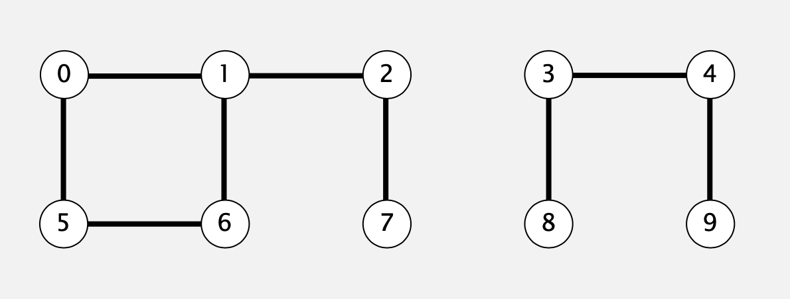
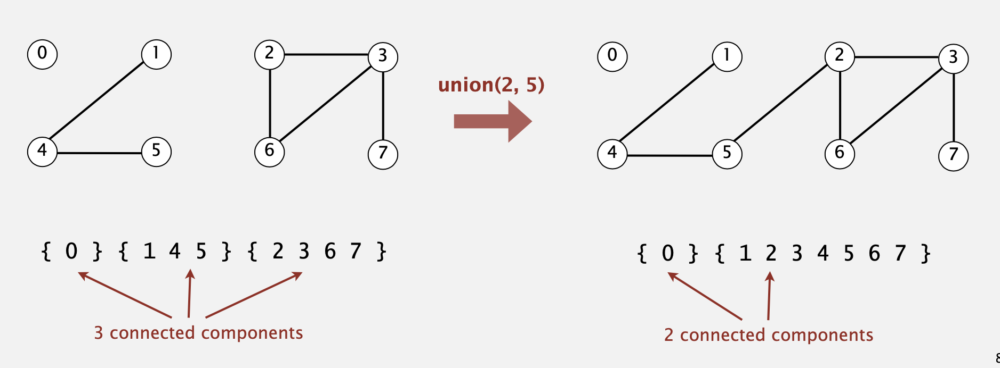
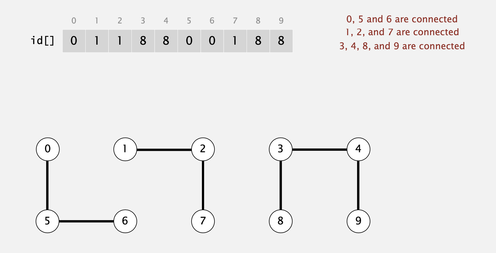

## 动态链接性
现在有一个N个对象的集合。

* 联合命令：连接两个对象
* 查找/连接判断：是否能找到一条路径连接给定的两个对象

执行下列方法后：

```
union(4, 3) 
union(3, 8)
union(6, 5) 
union(9, 4) 
union(2, 1) 
connected(0, 7)  // false
connected(8, 9)  // true
union(5, 0) 
union(7, 2) 
union(6, 1) 
union(1, 0) 
connected(0, 7)  // true
```

现在0-9的对象连接情况如下：



这里假设“连通”有以下特性：

* 反射性：p与p是连通的。

*  对称的：如果p与q是连通的，则q与p也是连通的。 

* 可传递：如果p与q连通且q与r连通，则p与r是连通的。

连通分量： 最多的相互连通对象的集合。

### 操作的实现

检查路径：检查两个对象是否联通

连接命令：连接连个对象并且替换他们所在的联通分量。



### Union-find 数据结构

设计有效的数据结构以进行Union-find

* 对象的数量N可能很大。
* 操作数M可能很大。
* 连接检测操作和联合命令可能会混合在一起。

```java
public class UF {
  	/*初始化UF类，并且传入对象个数N*/
    public UF(int N) {}
    /*将p和q联通*/
    void union(int p, int q) {}
    /*p和q是否连同?*/
    boolean connected(int p, int q) {return false}
}
```

## quick-find

数据结构：

* 一个长度为N的Integer数组id[]
* 如果p和q有相同的id，则它们是相连的。

 **查找：**检查p和q的id是否相同。

**联合：**要合并包含p和q的联通分量，将所有id等于id [p]的条目更改为id [q]。

代码实现：

```java
public class QuickFindUF {
    private int[] id;

    public QuickFindUF(int N) {
        id = new int[N];
        for (int i = 0; i < N; i++)
            id[i] = i;
       	printArray(id);
    }

    public boolean connected(int p, int q) {
        return id[p] == id[q];
    }

    public void union(int p, int q) {
        int pid = id[p];
        int qid = id[q];
      	//将所有id等于id[p]的条目更改为id[q]。
        for (int i = 0; i < id.length; i++) 
            if (id[i] == pid) id[i] = qid;       
        printArray(id);
    }

    public  void printArray(int[] arr ){
        System.out.print("[");
        for (int i:arr) {
            System.out.print(i+" ");
        }
        System.out.println("]");
    }
}
```

操作过程如下：

```java
QuickFindUF qf = new QuickFindUF(10);	  //[0 1 2 3 4 5 6 7 8 9 ]
qf.union(4, 3) 		//[0 1 2 3 3 5 6 7 8 9 ]
qf.union(3, 8)		//[0 1 2 8 8 5 6 7 8 9 ]
qf.union(6, 5) 		//[0 1 2 8 8 5 5 7 8 9 ]
qf.union(9, 4) 		//[0 1 2 8 8 5 5 7 8 8 ]
qf.union(2, 1) 		//[0 1 1 8 8 5 5 7 8 8 ]
qf.connected(0, 7)  // false
qf.connected(8, 9)  // true
qf.union(5, 0) 		//[0 1 1 8 8 0 0 7 8 8 ]
qf.union(7, 2) 		//[0 1 1 8 8 0 0 1 8 8 ]
qf.union(6, 1) 		//[1 1 1 8 8 1 1 1 8 8 ]
qf.union(1, 0) 		//[1 1 1 8 8 1 1 1 8 8 ]
qf.connected(0, 7)  // true
```

然而这种实现方式时间复杂度为O(n^2)。

### Quick-union

