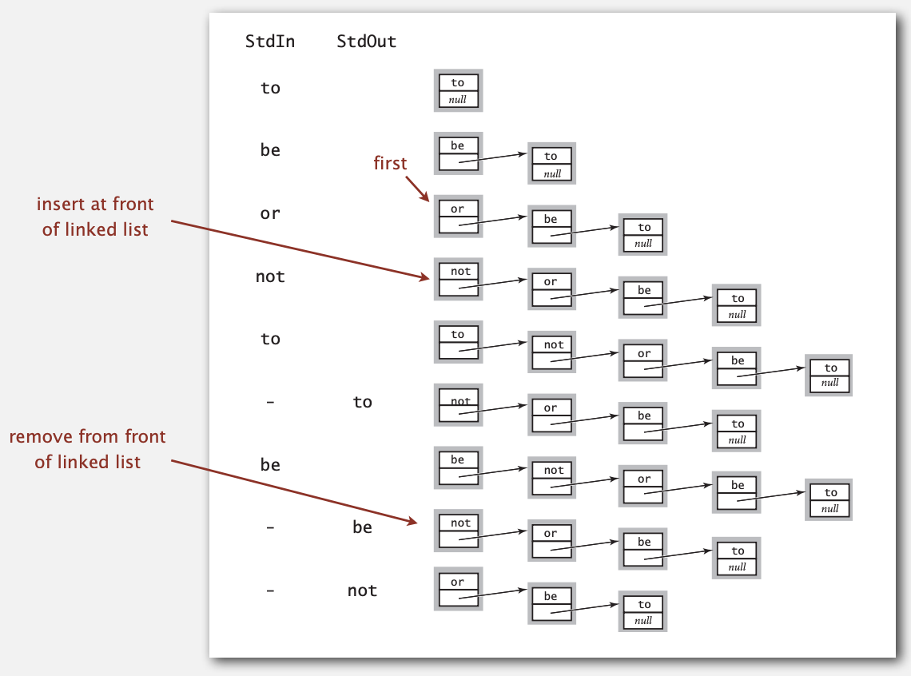
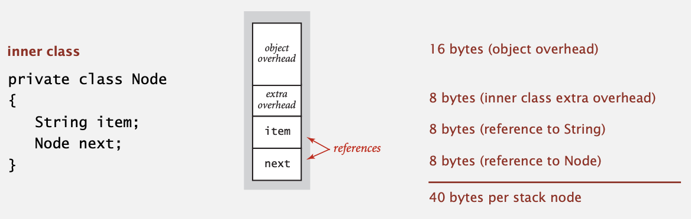
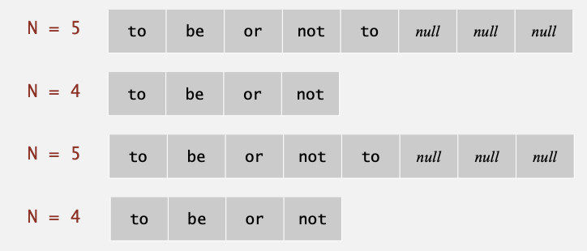
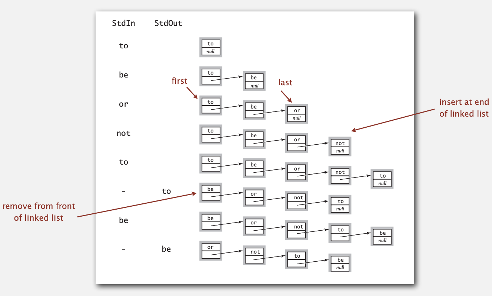

# 1.3  BAGS, QUEUES, AND STACKS

**基础数据类型**

* 值: 对象的集合

* 操作：插入，删除，迭代，判空
* 插入时意图明确
* 删除时应该删除哪个？
  * 栈：删除最近一次添加的元素（LIFO）
  * 队列：删除最早添加的元素（FIFO）

## Stacks

**栈API** 

```java
public class StackOfStrings
             StackOfStrings()       create an empty stack
       void  push(String item)      insert a new string onto stack
     String  pop()                  remove and return the string 
                                        most recently added
    boolean  isEmpty()              is the stack empty?
        int  size()                 number of strings on the stack
```

从标准输入中读取字符串。

* 如果字符串等于“-”，则从堆栈中弹出字符串并打印。
* 否则，将字符串推入堆栈。

```java
public static void main(String[] args) {
    StackOfStrings stack = new StackOfStrings();
    while (!StdIn.isEmpty()) {
        String s = StdIn.readString();
        if (s.equals("-")) StdOut.print(stack.pop());
        else stack.push(s);
    }
}
```

```
% more tobe.txt
to be or not to - be - - that - - - is
% java StackOfStrings < tobe.txt
to be not that or be
```

###  linked-list implementation

维护一个指向头节点的指针来进行插入删除操作



```java
public class LinkedStackOfStrings {
    private Node first = null;
  
    // 内部类，访问修饰符不重要
    private class Node {
        String item;
        Node next;
    }

    public boolean isEmpty() { return first == null; }
    public void push(String item) {
        Node oldfirst = first;
        first = new Node();
        first.item = item;
        first.next = oldfirst;
    }
    public String pop() {
        String item = first.item;
        first = first.next;
        return item;
    }
}
```

每次操作在最坏的情况下也都是常数时间。
一个带有N项的栈使用大概40N个字节。



> Note: 这就是栈的内存
> （但不包括用户所拥有的字符串本身的内存）。

### array implementation

使用数组来实现栈

* `push()`添加新元素s[i]
* `pop()`删除元素s[i - 1]

```
s[] to be or not to be null null null null
    0  1  2   3  4  5   6    7    8    9
                        N                    capacity = 10
```

**缺点：**当操作数超出容量，则会栈溢出

```java
public class FixedCapacityStackOfStrings {
    private String[] s;
    private int N = 0;

    public FixedCapacityStackOfStrings(int capacity)
    { s = new String[capacity]; }

    public boolean isEmpty()
    { return N == 0; }

    public void push(String item)
    { s[N++] = item; }

    public String pop()
    { return s[--N]; }
}
```

**Overflow and underflow. **

* Underflow: 对空栈进行pop操作

* Overflow: 使用可变数组实现栈

**Null items** 允许插入一个null

**Loitering** 对于不需要的元素仍然持有该元素引用

```java
public String pop() {
    String item = s[--N];
    s[N] = null;
    return item;
}
```

该优化可以解决"loitering"问题

### resizing-array implementation

定长数组的实现方式在用户调用API的时候，必须先传入指定容量，为了解决这个问题，使用变长数组，那么在什么时候改变数组大小？

* 每次push操作，将数组容量加1
* 每次pop操作，将数组容量减1

但是这样做没操作一次数组，就需要重新创建一个新数组，插入前N个元素所花费的时间与$1+2+...+N\text{~}N^{2}/2$成正比

优化：确保改变数组大小的操作不能太频繁

扩大数组操作：每次创建一个两倍大小的新数组

```java
public ResizingArrayStackOfStrings() { s = new String[1]; }

public void push(String item) {
    if (N == s.length) resize(2 * s.length);
    s[N++] = item;
}

private void resize(int capacity) {
    String[] copy = new String[capacity];
    for (int i = 0; i < N; i++)
        copy[i] = s[i];
    s = copy;
}
```

缩小数组操作：

* `push()`当数组满了，则扩大到当前数组的两倍大小
* `pop()`当数组的大小为整体容量的一半时，将数组缩小到现在容量的一半。

这样做有一种最坏的情况：



当数组刚好满的时候进行pop-push-pop-push的操作。

**优化** 进行pop操作时，当数组为1/4数组容量大小时，将数组改为当前容量的一半大小。

```java
public String pop() {
    String item = s[--N];
    s[N] = null;
    if (N > 0 && N == s.length/4) resize(s.length/2);
    return item;
}
```

**linked-list**

* 在最坏的情况下，每个操作都需要固定的时间。
* 使用额外的时间和空间来处理链接。

**resizing-array**

* 每次操作都需要不断的摊销时间。
* 减少空间浪费。

## Queues

**API**

```java
public class QueueOfString
             QueueOfString()       create an empty queue
       void  enqueue(String item)  insert a new string onto queue
     String  dequeue()             remove and return the string 
                                      least recently added
    boolean  isEmpty()             is the queue empty?
        int  size()                number of strings on the queue
```

### linked-list representation

维护只想头尾节点的单链表



```java
public class LinkedQueueOfStrings {
    private Node first, last;

    private class Node { /* same as in StackOfStrings */ }

    public boolean isEmpty() { return first == null; }

    public void enqueue(String item) {
        Node oldlast = last;
        last = new Node();
        last.item = item;
        last.next = null;
        if (isEmpty()) first = last;
        else oldlast.next = last;
    }

    public String dequeue() {
        String item = first.item;
        first = first.next;
        if (isEmpty()) last = null;
        return item;
    }
}
```

### resizing array implementation

使用变长数组来实现队列

* `push()`添加新元素q[tail]
* `pop()`删除元素q[head]
* 

```
s[] null null the best of times null null null null
      0    1   2    3   4    5   6    7    8    9
              head              tail                capacity = 10
```

## Parameterized stack

实现了StackOfString，还想实现StackOfURLs,StackOfInt,StackOfVans,...

引入范型

对基于链表实现的栈代码优化如下：

```java
public class Stack<Item> {
    private Node first = null;
    private class Node {
        Item item;
        Node next;
    }

    public boolean isEmpty() { return first == null; }

    public void push(Item item) {
        Node oldfirst = first;
        first = new Node();
        first.item = item;
        first.next = oldfirst;
    }

    public Item pop() {
        Item item = first.item;
        first = first.next;
        return item;
    }
}
```

对基于数组实现栈代码的优化：

```java
public class FixedCapacityStack<Item> {
    private Item[] s;
    private int N = 0;

    public FixedCapacityStack(int capacity) {
        s = (Item[]) new Object[capacity];
    }

    public boolean isEmpty() { return N == 0; }

    public void push(Item item) { s[N++] = item; }
    
    public Item pop() {
        Item item = s[--N];
        s[N] = null;
        return item;
    }
}
```

```
% javac FixedCapacityStack.java
Note: FixedCapacityStack.java uses unchecked or unsafe operations.
Note: Recompile with -Xlint:unchecked for details.
% javac -Xlint:unchecked FixedCapacityStack.java
FixedCapacityStack.java:26: warning: [unchecked] unchecked cast
found : java.lang.Object[]
required: Item[]
 a = (Item[]) new Object[capacity];
 ^
1 warning
```

对于基础数据类型，则使用java封装的对象类型

例如Integer就是int的封装类型

## Iteration

在java中，让栈实现`java.lang.Iterable`接口

```java
public interface Iterable<Item> {
    Iterator<Item> iterator();
    boolean hasNext();
    Item next();
}
```

为什么要实现数据迭代，因为java支持更优雅的代码：

```java
Iterator<String> i = stack.iterator();
while (i.hasNext()) {
    String s = i.next();
    StdOut.println(s);
}

for (String s : stack)
    StdOut.println(s);
```

### linked-list implementation

```java
import java.util.Iterator;
public class Stack<Item> implements Iterable<Item> {
    ...
    public Iterator<Item> iterator() { return new ListIterator(); }
    private class ListIterator implements Iterator<Item> {
        private Node current = first;
        public boolean hasNext() { return current != null; }
        public void remove() { /* not supported */ }
        public Item next() {
            Item item = current.item;
            current = current.next;
            return item;
        }
    }
}
```

### array implementation

```java
import java.util.Iterator;
public class Stack<Item> implements Iterable<Item> {
    ...
    public Iterator<Item> iterator() { 
      return new ReverseArrayIterator(); 
    }
    private class ReverseArrayIterator implements Iterator<Item> {
        private int i = N;
        public boolean hasNext() { return i > 0; }
        public void remove() { /* not supported */ }
        public Item next() { return s[--i]; }
    }
}
```

## Bag

是一个无序的集合

**API**

```java
   public class Bag<Item> implements Iterable<Item>
                Bag()         create an empty bag
          void  add(Item x)   insert a new item onto bag
           int  size()        number of items in bag
Iterable<Item>  iterator()    iterator for all items in bag
```

可以看成是没有pop的栈或是没有dequeue的队列

## Dequeue

```java
import java.util.Iterator;

/*
Throw an IllegalArgumentException if the client calls either addFirst() or addLast() with a null argument.
Throw a java.util.NoSuchElementException if the client calls either removeFirst() or removeLast when the deque is empty.
Throw a java.util.NoSuchElementException if the client calls the next() method in the iterator when there are no more items to return.
Throw an UnsupportedOperationException if the client calls the remove() method in the iterator.
*/
public class Deque<Item> implements Iterable<Item> {

    private Node first, last = null;
    private Integer size = 0;

    private class Node {
        Item item;
        Node next;
    }

    // construct an empty deque
    public Deque() {
    }

    // is the deque empty?
    public boolean isEmpty() {
        return first == null;
    }

    // return the number of items on the deque
    public int size() {
        return size;
    }

    // add the item to the front
    public void addFirst(Item item) {

    }

    // add the item to the back
    public void addLast(Item item) {

    }

    // remove and return the item from the front
    public Item removeFirst() {

    }

    // remove and return the item from the back
    public Item removeLast() {

    }

    // return an iterator over items in order from front to back
    public Iterator<Item> iterator() {
        return new ListIterator();
    }

    private class ListIterator implements Iterator<Item> {
        private Node current = first;

        public boolean hasNext() {
            return current != null;
        }

        public Item next() {
            Item item = current.item;
            current = current.next;
            return item;
        }
    }

    // unit testing (required)
    public static void main(String[] args) {
				
    }
}
```

