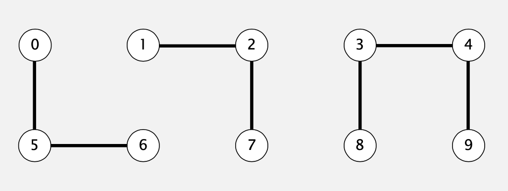
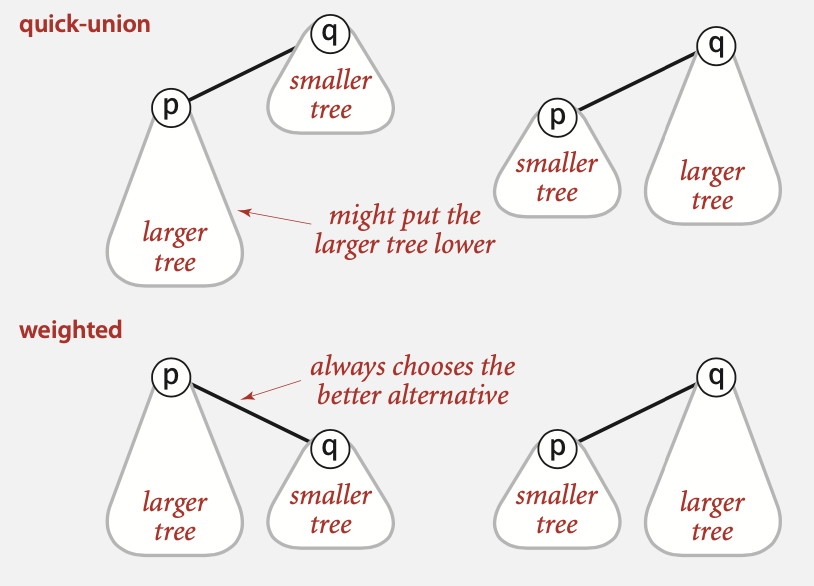
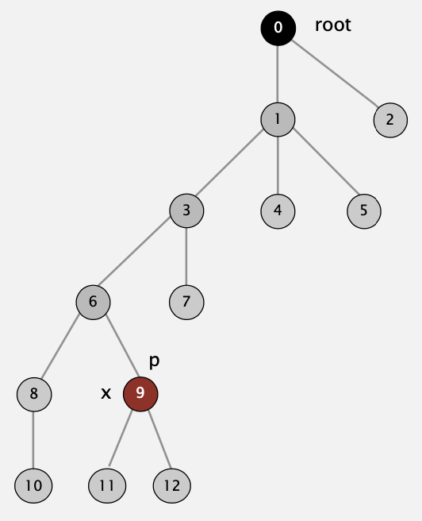
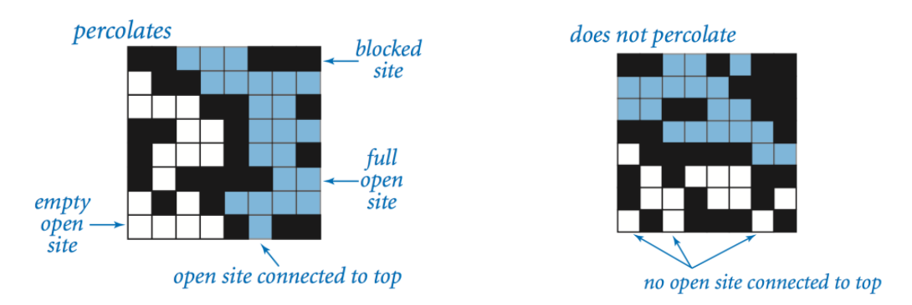
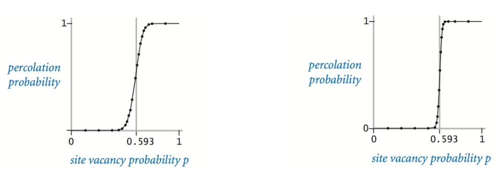
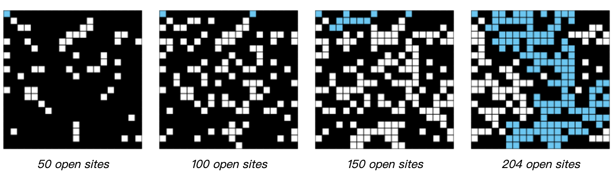

# 1.5 UNION-FIND

## Quick-find

### Data Structure

* 创建一个长度为N的数组
* p和q位置存储的id相同时，则认为p和q是相连的

```java
      0 1 2 3 4 5 6 7 8 9
id[]  0 1 1 8 8 0 0 1 8 8
```



width="60%"

### Find

判断pq是否相连，检查p与q的id是否相同。 

> id[6] **=** 0;id[1] **=** 1 6和1不是相连的

### Union

要合并包含p和q的所有条目，需将所有id等于id [p]的条目都更改为id [q]。

```java
      0 1 2 3 4 5 6 7 8 9
id[]  1 1 1 8 8 1 1 1 8 8    合并了6和1之后
      |         | |
       需要更所有条目
```


#### implementation

```java
public class QuickFindUF {
  private int[] id;

  public QuickFindUF(int N) {
    id = new int[N];
    for (int i = 0; i < N; i++)
      id[i] = i;
  }

  public boolean connected(int p, int q) {
    return id[p] == id[q];
  }

  public void union(int p, int q) {
    int pid = id[p];
    int qid = id[q];
    for (int i = 0; i < id.length; i++) {
      if (id[i] == pid) id[i] = qid;
    }
  }
}
```

### Cost model

| algorithm  | initialize | union | find |
| :--------: | :--------: | :---: | :--: |
| quick-find |     N      |   N   |  1   |

时间复杂度为$ N^{2} $。

## Quick-union

### Data structure

* 长度为N的数组id[]
* id[i]中存放的是i的父节点
* i的根节点为id[id[id[...id[i]...]]]

```java
     0 1 2 3 4 5 6 7 8 9
id[] 0 1 9 4 9 6 6 7 8 9
```

如下图中3的根节点为9，5的根节点是6，3与5不相连。


### Find

判断pq是否相连，检查p与q的根节点是否相同。 

### Union

要合并包含p和q的所有条目，需将p的根节点设置为q的根节点。

```java
     0 1 2 3 4 5 6 7 8 9
id[] 0 1 9 4 9 6 6 7 8 6
                       |
                 只需要修改这一项
```


### implementation

```java
public class QuickFindUF {
  private int[] id;
  public QuickUnionUF(int N) {
    id = new int[N];
    for (int i = 0; i < N; i++)
      id[i] = i;
  }
  
  private int root(int i) {
    while (i != id[i]) i = id[i];
    return i
  }
  
  public boolean connected(int p, int q) {
    return root(p) == root(q);
  }

  public void union(int p, int q) {
    int i = root(p);
    int j = root(q);
    id[i] = j;
  }
}
```

### Cost model

|  algorithm  | initialize | union | find |
| :---------: | :--------: | :---: | :--: |
| quick-find  |     N      |   N   |  1   |
| quick-union |     N      | $N^+$ |  N   |

合并操作中，多出的时间消耗`+`为寻找根节点的时间。

### Weighting quick-union

* 优化quick-union避免树过高

* 追踪每棵树的大小

* 将小树的根链接到大树的根上



Quick-union与weighted后的对比：


### Data structure

与quick-union相同，但是要多维护一个sz[i]的数组，来存放以i为根节点的树的大小。

### Find

与quick-union相同 `return root(p)== root(q);`

### Union

在quick-union的基础上修改：

* 将较小的树链接到大树上
* 更新sz[]数组

```java
int i = root(p);
int j = root(q);
if (i == j) return;
if (sz[i] < sz[j]) { id[i] = j; sz[j] += sz[i]; }
else               { id[j] = i; sz[i] += sz[j]; }
```

### Cost model

|  algorithm  | initialize |    union     |    find    |
| :---------: | :--------: | :----------: | :--------: |
| quick-find  |     N      |      N       |     1      |
| quick-union |     N      |    $N^+$     |     N      |
| weighted QU |     N      | $log_2{N^+}$ | $log_2{N}$ |

## Path compression

### Quick union with path compression.

在计算p的根结点后，将路径上涉及的根结点都指向p的最终根结点。




### implementation

使路径中的每个其他节点都指向其根结点（从而将路径长度减半）。

```java
private int root(int i) {
  while(i != id[i]) {
    id[i] = id[id[i]];     // 只需添加这一行代码
    i = id[i];
  }
  return i;
}
```

### Cost model

|           algorithm            | worst-cast time |
| :----------------------------: | :-------------: |
|           quick-find           |       M N       |
|          quick-union           |       M N       |
|          weighted QU           |   N + M log N   |
|      QU+path compression       |   N + M log N   |
| weighted QU + path compression |   N + M lg* N   |


## Percolation

**渗透** 给定一个由随机分布的绝缘和金属材料组成的复合系统：材料的哪部分需要是金属，使复合系统是导电体？如果地面（或下面的油）有水的多孔景观，在什么条件下水可以流到底部（或流到表面的油）？科学家已经定义了一个抽象的过程，称为渗透来模拟这样的情况。
**模型** 我们模拟一个渗流系统使用nxn的网格。每个格子要么打开，要么被阻塞。充满的格子是一个打开的格子，可以通过相邻（左、右、上、下）开放的格子链连接到顶部行中的打开格子，如果有一个充满的格子在底部，则称该系统渗透。换句话说，如果我们填充所有连接到顶行的打开的格子，那么系统就是渗透的，而这个过程会填充底部行上的一些开放站点。（例如，对于绝缘/金属材料，开放的格子对应于金属材料，因此渗滤系统具有从上到下的金属路径，并具有充满的格子。）对于多孔物质的例子，开放的格子对应着水可能通过的空的空间，所以一个系统，渗水，让水填充开放的格子，从上到下流动。



（白色对应打开，黑色为阻塞，蓝色为填满）

**问题** 在一个著名的科学问题中，研究人员对以下问题感兴趣：如果格子打开的概率为p（因此有1-p的概率阻塞），系统渗透的概率是多少？当p=0时，系统不渗滤；当p=1时，系统渗滤。下面的图显示了20乘20随机网格（左）和100乘100随机网格（右）的格子空缺概率p与渗流概率。



当n足够大时，有一个阈值p\*当p<p\*为随机数时,n乘n网格几乎从不渗透，当p>p\*时，网格几乎总是渗透的。目前还没有得到确定渗流阈值p\*的数学解。你的任务是编写一个计算机程序来估计P*。

**Percolation**

```java
/* *****************************************************************************
 *  Name:              Alan Turing
 *  Coursera User ID:  123456
 *  Last modified:     1/1/2019
 **************************************************************************** */

import edu.princeton.cs.algs4.StdOut;
import edu.princeton.cs.algs4.WeightedQuickUnionUF;

public class Percolation {
    private int n;
    private boolean[] status;
    private int numberOfOpenSite;
    private WeightedQuickUnionUF wquuf;

    // creates n-by-n grid, with all sites initially blocked
    public Percolation(int n) {
        if (n < 0) throw new IllegalArgumentException();
        this.n = n;
        // n + 2 for virtual top and bottom
        wquuf = new WeightedQuickUnionUF((n + 1) * (n + 2));
        status = new boolean[(n + 1) * (n + 2)];
        for (int i = 0; i < status.length; i++) {
            status[i] = false;
        }
    }

    private int oneDimension(int row, int col) {
        return row * (n + 1) + col;
    }

    // opens the site (row, col) if it is not open already
    public void open(int row, int col) {
        validate(row, col);
        if (isOpen(row, col)) {
            return;
        }
        status[oneDimension(row, col)] = true;
        numberOfOpenSite += 1;
        int temp1 = oneDimension(row, col);
        //if neighbor could be connected?
        if (row == 1) {
            wquuf.union(0, temp1);
        }
        if (row == n) {
            wquuf.union((n + 1) * (n + 1), temp1);
        }
        int[] dx = { 1, -1, 0, 0 };
        int[] dy = { 0, 0, 1, -1 };
        for (int i = 0; i < 4; i++) {
            int newRow = row + dx[i];
            int newCol = col + dy[i];
            int temp2 = oneDimension(newRow, newCol);
            if (status[temp2]) {
                wquuf.union(temp1, temp2);
            }
        }
    }

    // is the site (row, col) open?
    public boolean isOpen(int row, int col) {
        validate(row, col);
        return status[oneDimension(row, col)];
    }

    // is the site (row, col) full?
    public boolean isFull(int row, int col) {
        validate(row, col);
        int p = wquuf.find(0);
        int q = wquuf.find(oneDimension(row, col));
        return p == q;
    }

    // returns the number of open sites
    public int numberOfOpenSites() {
        return numberOfOpenSite;
    }

    // does the system percolate?
    public boolean percolates() {
        return wquuf.find(0) == wquuf.find((n + 1) * (n + 1));
    }

    private void validate(int row, int col) {
        if (row < 1 || row > n || col < 1 || col > n) {
            throw new IllegalArgumentException("illegal row or col!");
        }
    }

    // // test client (optional)
    public static void main(String[] args) {
        Percolation p = new Percolation(5);
        p.open(1, 2);
        p.open(2, 2);
        p.open(3, 2);
        StdOut.println(p.isOpen(1, 1));
        StdOut.println(p.percolates());
    }
}

```

**蒙特卡罗模拟**  要估计渗流阈值，请考虑以下计算实验：

* 初始化所有格子为封闭状态。
* 重复以下步骤，直到系统过滤：

  * 在所有被封闭的格子中均匀随机地选择一个格子。

  * 打开格子。
* 当系统渗流时打开的格子的比例提供了渗流阈值的估计值。

例如，如果站点根据下面的图片在20乘20的格子中打开，那么我们对渗流阈值的估计是204/400=0.51，因为当第204个站点被打开时，系统渗流。



通过重复这个计算实验T次和平均的结果，我们得到了一个更准确的估计的渗流阈值。 设$x_t$为计算实验t次中开放格子的分数。 样本平均值$\bar x$⎯⎯⎯提供了渗滤阈值的估计值； 样本标准差s; 测量阈值的锐度。

$$ \overline x  = \frac{x_1 \, + \, x_2 \, + \, \cdots \, + \, x_{T}}{T}, \quad s^2  = \frac{(x_1 - \overline x )^2 \, + \, (x_2 - \overline x )^2 \,+\, \cdots \,+\, (x_{T} - \overline x )^2}{T-1}$$

假设T足够大（例如，至少30），下面的方法为渗流阈值提供了95%的置信区间：

$$\left [ \; \overline x  -  \frac {1.96 s}{\sqrt{T}}, \;\;           \overline x  +  \frac {1.96 s}{\sqrt{T}} \; \right]$$

**PercolationStats**

```java
/* *****************************************************************************
 *  Name:              Alan Turing
 *  Coursera User ID:  123456
 *  Last modified:     1/1/2019
 **************************************************************************** */

import edu.princeton.cs.algs4.StdOut;
import edu.princeton.cs.algs4.StdRandom;
import edu.princeton.cs.algs4.StdStats;

public class PercolationStats {

    private int trials;
    // threshold P
    private double[] preP;

    // perform independent trials on an n-by-n grid
    public PercolationStats(int n, int trials) {
        if (n < 1 || trials < 1) {
            throw new IllegalArgumentException("Illegal n or trialNum,please check");
        }
        this.trials = trials;
        preP = new double[trials];
        for (int i = 0; i < trials; i++) {
            Percolation p = new Percolation(n);
            while (!p.percolates()) {
                int row = StdRandom.uniform(n) + 1;
                int col = StdRandom.uniform(n) + 1;
                p.open(row, col);
                if (p.percolates()) break;
            }
            preP[i] = (double) p.numberOfOpenSites() / (n * n);
        }
    }

    // sample mean of percolation threshold
    public double mean() {
        return StdStats.mean(preP);
    }

    // sample standard deviation of percolation threshold
    public double stddev() {
        return StdStats.stddev(preP);
    }

    // low endpoint of 95% confidence interval
    public double confidenceLo() {
        return mean() - 1.96 * stddev() / Math.sqrt(trials);
    }

    // high endpoint of 95% confidence interval
    public double confidenceHi() {
        return mean() + 1.96 * stddev() / Math.sqrt(trials);
    }

    // // test client (see below)
    public static void main(String[] args) {
        int n = 25, trialNum = 1000;
        PercolationStats ps = new PercolationStats(n, trialNum);
        StdOut.println("size:" + n + "*" + n);
        StdOut.println("trial times :" + trialNum);
        StdOut.println("mean of p :" + ps.mean());
        StdOut.println("standard deviation :" + ps.stddev());
        StdOut.println("confidence interval low :" + ps.confidenceLo());
        StdOut.println("confidence interval high :" + ps.confidenceHi());
    }
}

```

