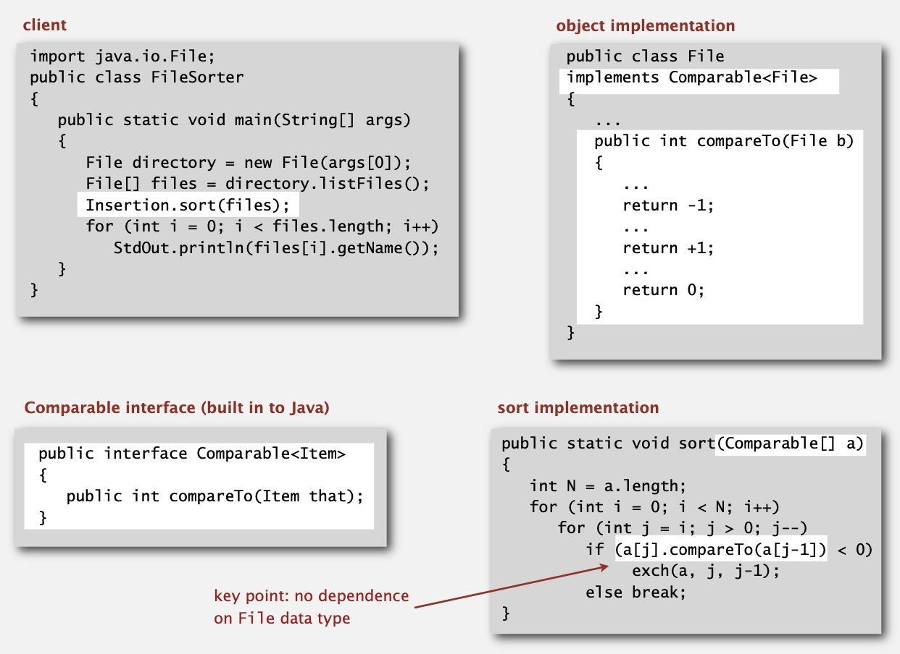

# 2.1 ELEMENTARY SORTS

## rules of the game

**Ex1.** 对数字进行排序

```java
public class Experiment {
    public static void main(String[] args) {
        int N = Integer.parseInt(args[0]);
        Double[] a = new Double[N];
        for (int i = 0; i < N; i++)
            a[i] = StdRandom.uniform();
        Insertion.sort(a);
        for (int i = 0; i < N; i++)
            StdOut.println(a[i]);
    }
}
```

```powershell
% java Experiment 10 
0.08614716385210452 
0.09054270895414829 
0.10708746304898642 
0.21166190071646818 
0.363292849257276 
0.460954145685913 
0.5340026311350087 
0.7216129793703496 
0.9003500354411443 
0.9293994908845686
```


**Ex2.**对字符串根据字母顺序排序

```java
public class StringSorter {
    public static void main(String[] args) {
        String[] a = In.readStrings(args[0]);
        Insertion.sort(a);
        for (int i = 0; i < a.length; i++)
            StdOut.println(a[i]);
    }
}
```

```powershell
% more words3.txt
bed bug dad yet zoo ... all bad yes
% java StringSorter words3.txt
all bad bed bug dad ... yes yet zoo
```


**Ex3.**根据文件名对文件路径进行排序

```java
import java.io.File;

public class FileSorter {
    public static void main(String[] args) {
        File directory = new File(args[0]);
        File[] files = directory.listFiles();
        Insertion.sort(files);
        for (int i = 0; i < files.length; i++)
            StdOut.println(files[i].getName());
    }
}
```

```java
% java FileSorter . 
Insertion.class 
Insertion.java 
InsertionX.class 
InsertionX.java 
Selection.class 
Selection.java 
Shell.class 
Shell.java 
ShellX.class 
ShellX.java
```

`sort()`方法如何在不知道传入参数信息的情况下进行排序的呢？

`sort()`方法通过调用`compareTo()`回调方法来确定比较的方式。



假设`v.compareTo(w)`

如果v小于w返回-1，等于返回0，大于则返回1。

**Date data type.**以date类型为例，java.util.Date实现方式：

```java
public class Date implements Comparable<Date> {
    private final int month, day, year;

    public Date(int m, int d, int y) {
        month = m;
        day = d;
        year = y;
    }

    public int compareTo(Date that) {
        if (this.year < that.year) return -1;
        if (this.year > that.year) return 1;
        if (this.month < that.month) return -1;
        if (this.month > that.month) return 1;
        if (this.day < that.day) return -1;
        if (this.day > that.day) return 0;
    }
}
```

## selection sort

遍历数组中的元素，每次从左向右扫描，记录最小值的位置，最小值位置初始设置为当前循环的初始位置，然后遍历的当前元素与之前记录的最小元素进行比较，如果需要则更换最小元素位置，每次遍历后交换。

java实现如下：

```java
public class Selection {
    public static void sort(Comparable[] a) {
        for (int i = 0; i < a.length - 1; i++) {
            int minIndex = i;
            for (int j = i + 1; j < a.length; j++) {
                if (less(a[j], a[minIndex])) {
                    minIndex = j;
                }
            }
            exch(a, i, minIndex);
        }
    }

    private static boolean less(Comparable v, Comparable w) {
        return v.compareTo(w) < 0;
    }

    private static void exch(Comparable[] a, int i, int j) {
        Comparable swap = a[i];
        a[i] = a[j];
        a[j] = swap;
    }
}
```

选择排序比较次数为$(N-1)+(N-2)+...+1+0\text{ ~ }N^{2}/2$，交换的次数为N。

时间复杂度为$O(N^{2})$，尽管数组已经排序。交换时间与N成正比。

## Insertion sort

从左向右扫描，在排序时左侧总是按照升序排好的，每扫描一个新的元素，则让新元素与左侧的所有元素依次比较，直到使左侧又恢复升序排列。

java实现：

```java
public class Insertion {
    public static void sort(Comparable[] a) {
        for (int i = 0; i < a.length - 1; i++) {
            for (int j = i; j > 0; j--) {
                if (less(a[j], a[j - 1])) {
                    exch(a, j, j - 1);
                } else {
                    break;
                }
            }
        }
    }

    private static boolean less(Comparable v, Comparable w) {
        return v.compareTo(w) < 0;
    }

    private static void exch(Comparable[] a, int i, int j) {
        Comparable swap = a[i];
        a[i] = a[j];
        a[j] = swap;
    }
}
```

当排序的数组时乱序的时候，插入排序平均进行了$~\frac{1}{4} N^2$次比较与$~\frac{1}{4} N^2$次的交换。

最好的情况下，插入排序对已经排好序的数组进行排序，则比较N-1次，交换0次。

最坏的情况下，插入排序对逆序排列的数组进行升序排序，则需要比较$~\frac{1}{2} N^2$次，交换$~\frac{1}{2} N^2$次。

对于部分排好序的数组，插入排序则可以保证在线性时间内完成操作。

## shell sort

一个h-sort的数组是h个交错的排序子序列

```
h = 4
L  E  E  A  M  H  L  E  P  S  O  L  T  S  X  R
L-----------M-----------P-----------T
   E-----------H-----------S-----------S
      E-----------L-----------O-----------X
         A-----------E-----------L-----------R
```

使用h-sort排序时，排序方法为插入排序，步长为h。

一次完整的排序过程：


那么如何确定步长的增量，有以下几种方式：

**Powers of two. ** 1, 2, 4, 8, 16, 32, ... 

No.

**Powers of two minus one.** 1, 3, 7, 15, 31, 63, ...

 Maybe.

**3x + 1.** 1, 4, 13, 40, 121, 364, ... 

OK. Easy to compute.

**Sedgewick. **1, 5, 19, 41, 109, 209, 505, 929, 2161, 3905, ... 

Good. Tough to beat in empirical studies.

java实现：

```java
public class Shell {
    public static void sort(Comparable[] a) {
        int N = a.length;
        int h = 1;

        while (h < N / 3) h = 3 * h + 1; //1, 4, 13, 40, 121, 364, ...

        while (h >= 1) { // h-sort the array.
            for (int i = h; i < N; i++) {
                for (int j = i; j >= h && less(a[j], a[j - h]); j -= h) {
                    exch(a, j, j - h);
                }
            }

            h = h / 3;
        }
    }

    private static boolean less(Comparable v, Comparable w) {
        return v.compareTo(w) < 0;
    }

    private static void exch(Comparable[] a, int i, int j) {
        Comparable swap = a[i];
        a[i] = a[j];
        a[j] = swap;
    }
}
```

使用3x+1增量的最坏时间复杂度为$O(N^{3/2})$。

## shuffling

重新排列数组，得到一个随机的排列

### Knuth shuffle

在迭代i时，随机地均匀地选择介于0和i之间的整数r。 交换a [i]和a [r]。

java实现：

```java
public static void shuffle(Object[] a) {
    int N = a.length;
    for (int i = 0; i < N; i++) {
        int r = StdRandom.uniform(i + 1);
        exch(a, i, r);
    }
}
```


