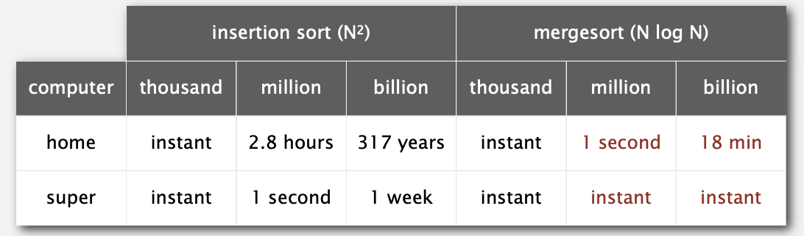
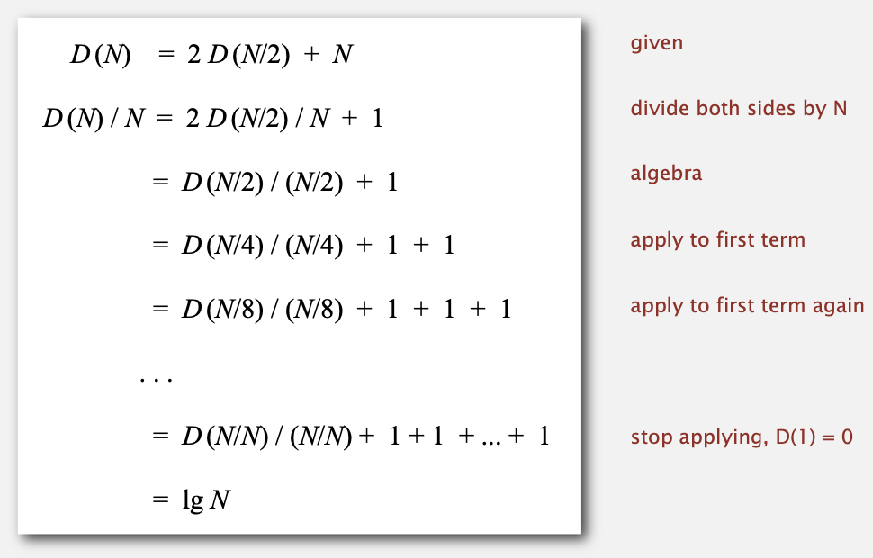
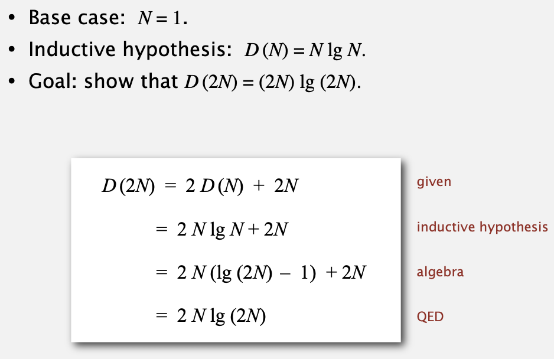
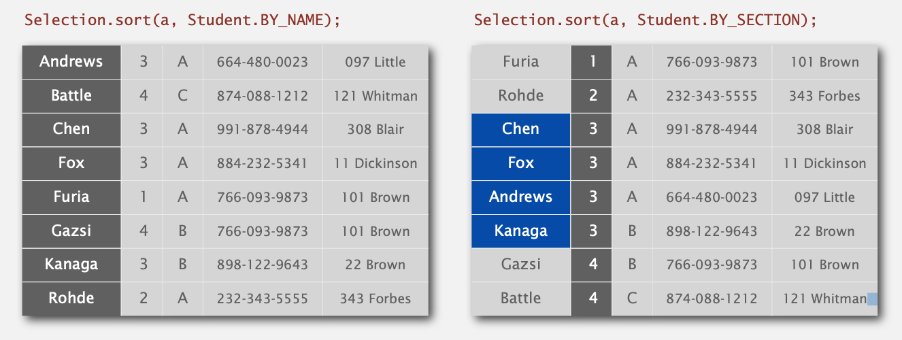
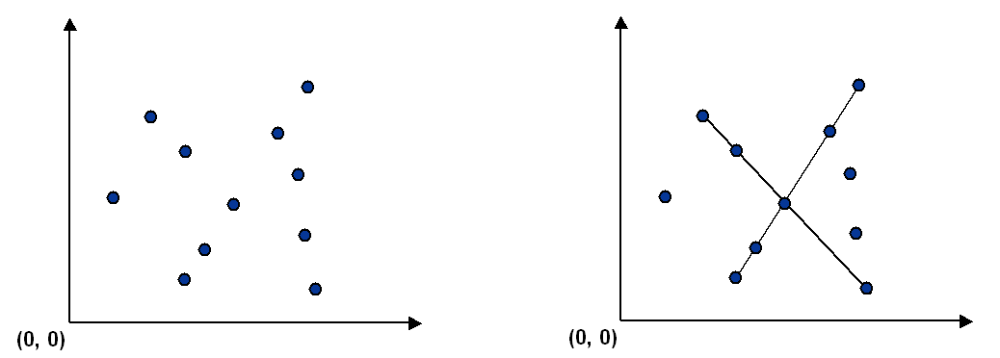
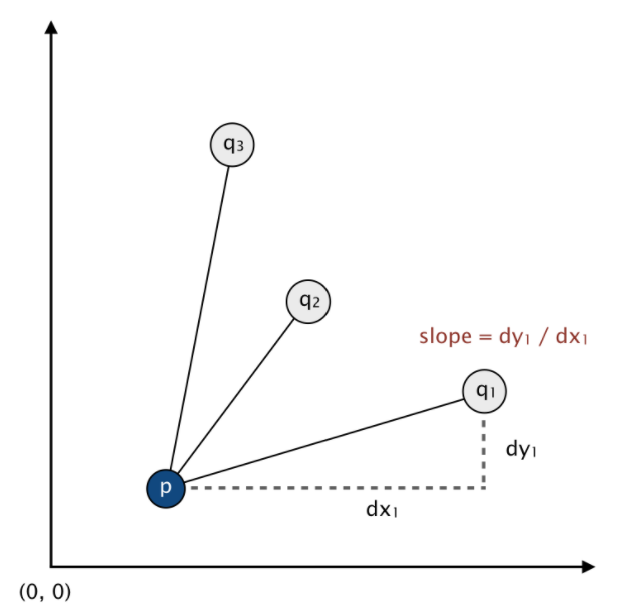

# 2.2 MERGESORT

快速排序被誉为20世纪科学和工程学的十大算法之一。

**Mergesort.**

* Java对对象进行排序。
* Perl，C ++稳定排序，Python稳定排序，Firefox JavaScript，...

**Quicksort**

* Java对原始类型排序
* C qsort，Unix，Visual C ++，Python，Matlab，Chrome JavaScript，...

## mergesort

将数组分开两半，然后递归排序各自两半，最后再整合到一起。

给出两个已经排好序的子数组`a[lo]`到`a[mid]`和`a[mid+1]`到`a[hi]`，替换为排好序的数组`a[lo]`到`a[hi]`。

merge操作的java实现：

```java
private static void merge(Comparable[] a, Comparable[] aux, int lo, int mid, int hi) {
        assert isSorted(a, lo, mid);  // precondition: a[lo..mid] sorted
        assert isSorted(a, mid+1, hi);// precondition: a[mid+1..hi] sorted
        for (int k = lo; k <= hi; k++)         // copy
            aux[k] = a[k];

        int i = lo, j = mid+1;
        for (int k = lo; k <= hi; k++) {       // merge
            if      (i > mid)              a[k] = aux[j++];
            else if (j > hi)               a[k] = aux[i++];
            else if (less(aux[j], aux[i])) a[k] = aux[j++];
            else                           a[k] = aux[i++];
        }
        assert isSorted(a, lo, hi);  // postcondition: a[lo..hi] sorted
    }
```

**Java assert statement. **除非条件为真，否则抛出异常。

> assert isSorted(a, lo, hi);

**Can enable or disable at runtime. ** ⇒ 不会影响生产代码。

```
java -ea MyProgram // enable assertions
java -da MyProgram // disable assertions (default)
```

整体的排序实现：

```java
public class Merge  {
    private static void merge(...) { /* as before */ }

    private static void sort(Comparable[] a, Comparable[] aux, int lo, int hi) {
        if (hi <= lo) return;
        int mid = lo + (hi - lo) / 2; 
        sort(a, aux, lo, mid); 
        sort(a, aux, mid+1, hi); 
        merge(a, aux, lo, mid, hi);
    }
    
    public static void sort(Comparable[] a) {
        aux = new Comparable[a.length];
        sort(a, aux, 0, a.length - 1); 
    }
}
```

**Running time estimates:**

笔记本电脑每秒执行$10^8$次比较。超级计算机每秒执行$10^{12}$次比较。对比如下：



归并排序的时间复杂度

如果 *D*(*N*) 满足 *D*(*N*) = 2 *D*(*N* / 2) + *N* ( *N* > 1), 且 *D*(1) = 0, 则 *D* (*N*) = *N* lg *N*。[假设N为2的证书次幂]

**Proof 1.**  通过图像


**Proof2. ** 拓展证明



**Proof3.** 归纳证明



归并排序需要额外的辅助数组来进行排序，因此在空间上不是很完美，现有的挑战则是将归并排序原地进行。

在排序的时候，对太小的数组进行排序开销有些大，如果数组的元素个数大于7个，再使用归并排序。

### 实践优化

如果归并时，左侧数组的最大元素小于右侧数组的最小元素，则不进行排序操作。

```java
private static void sort(Comparable[] a, Comparable[] aux, int lo, int hi) {
    if (hi <= lo) return;
    int mid = lo + (hi - lo) / 2;
    sort(a, aux, lo, mid);
    sort(a, aux, mid + 1, hi);
    if (!less(a[mid+1], a[mid])) return;
    merge(a, aux, lo, mid, hi);
}
```

## bottom-up mergesort

也可不使用递归来进行排序操作，java实现如下：

```java
private static void merge(...) 
{/*as before*/}

private static void sort(Comparable[] a) {
    int N = a.length;
    Comparable[] aux = new Comparable[N];
    for (int sz = 1; sz < N; sz = sz + sz)
        for (int lo = 0; lo < N - sz; lo += sz + sz)
            merge(a, aux, lo, lo + sz-1,  Math.min(lo + sz + sz - 1,N - 1));
}
```

## stability

如果要对于一组数据，根据不同条目来进行排序，那么第二次排序时，希望在同等key的条目中，保持第一次排序的顺序。



上图中对section排序后，相同的section中，name则变为乱序。以上则称该算法不稳定。

稳定排序：插入排序，归并排序

不稳定排序：选择排序，希尔排序

## Collinear Points

编写一个程序来识别给定点集合中的线模式。
计算机视觉涉及到分析视觉图像中的模式和重建产生它们的现实世界的对象。该过程通常分为两个阶段：特征检测和模式识别。特征检测涉及选择图像的重要特征，模式识别涉及发现特征中的模式。

**The problem.** 给定平面中n个不同点的集合，找到连接4个或更多点的子集的（最大）线段。



**Point data type. **创建一个不可变的数据类型Point，以表示平面中的一个点：

```java
public class Point implements Comparable<Point> {
   public Point(int x, int y)                         // constructs the point (x, y)

   public   void draw()                               // draws this point
   public   void drawTo(Point that)                   // draws the line segment from this point to that point
   public String toString()                           // string representation

   public               int compareTo(Point that)     // compare two points by y-coordinates, breaking ties by x-coordinates
   public            double slopeTo(Point that)       // the slope between this point and that point
   public Comparator<Point> slopeOrder()              // compare two points by slopes they make with this point
}
```

使用 [Point.java](https://coursera.cs.princeton.edu/algs4/assignments/collinear/files/Point.java)文件, 实现了 `draw()`, `drawTo()`, 和 `toString()` 方法。需要自己实现以下功能：

* `compareTo()`方法应该根据点的y坐标进行比较，通过x坐标打破连接。在形式上，调用方法的点$（x_0，y_0）$小于传入的参数点$（x_1，y_1）$，当且仅当$y_0<y_1$或$y_0=y_1$和$x_0<x_1$。
* `slopeTo()`方法应该返回调用点$（x_0，y_0）$和传入参数点$（x_1，y_1）$之间的斜率，公式$(y_1-y_0）/（x_1-x_0）$给出了这个斜率。将水平线段的斜率视为零；将垂直线段的斜率视为正无穷大；将退化线段的斜率（在点与自身之间）视为负无穷大。
* `slopeOrder（）`方法应该返回一个比较器，该比较器用它的两个参数点与调用点$（x_0，y_0）$的斜率进行比较。形式上，点$（x_1，y_1）$小于点$（x_2，y_2）$。当且仅当斜率$（y_1-y_0）/（x_1-x_0）$小于斜率$（y_2-y_0）/（x_2-x_0）$。将水平段、垂直段和退化线段处理为`slopeTo()`方法。
* 不要重写`equals()`或`hashCode()`方法。

**Line segment data type.** 表达平面上的直线, 使用[LineSegment.java](https://coursera.cs.princeton.edu/algs4/assignments/collinear/files/LineSegment.java)文件：

```java
public class LineSegment {
   public LineSegment(Point p, Point q)        // constructs the line segment between points p and q
   public   void draw()                        // draws this line segment
   public String toString()                    // string representation
}
```

**Brute force.**  编写程序`BruteCollinearPoints.java`，一次检查4个点，并检查它们是否都位于同一线段上，并返回所有此类线段。 要检查4个点p，q，r和s是否共线，请检查p和q之间，p和r之间以及p和s之间的三个斜率是否相等。

```java
public class BruteCollinearPoints {
   public BruteCollinearPoints(Point[] points)    // finds all line segments containing 4 points
   public           int numberOfSegments()        // the number of line segments
   public LineSegment[] segments()                // the line segments
}
```

`segments()`方法应该包括每个包含4个点的线段一次。如果4个点出现在线段上，其顺序为p→q→r→s，则应包括线段p→s或s→p。(但不是两者都有)你不应该包含子线段p→r或q→r。为简单起见，我们将不提供任何输入到`BruteCollinearPoints`具有5个或更多的共线点。

*Corner cases.* 如果构造函数的参数为空，数组中的任意点为空，或者构造函数的参数包含一个重复的点，则抛出`IllegalArgumentException`。

*Performance requirement.* 在最坏的情况下，程序的运行时间为$n^4$，空间上应该占有与n成比的空间加上返回的线段的数量。

**A faster, sorting-based solution.** 值得注意的是，解决这个问题的速度比上面描述的暴力解决方案要快得多。给定一个点p，下面的方法确定p是否参与一组4个或更多共线点。

* 把p当成原点。

* 对于其他点q，确定它与p产生的斜率。

* 根据他们用p做的斜率对点进行排序。

* 检查是否有3个（或更多）相邻的点在排序顺序有相等的斜率相对于p。如果是这样，这些点和p是共线的。

应用此方法的每个n个点依次产生一个有效的算法的问题。该算法解决了这个问题，因为具有相等斜率的点对p是共线的，排序将这些点聚集在一起。该算法是快速的，因为操作瓶颈是排序算法。



```java
public class FastCollinearPoints {
   public FastCollinearPoints(Point[] points)     // finds all line segments containing 4 or more points
   public           int numberOfSegments()        // the number of line segments
   public LineSegment[] segments()                // the line segments
}
```

`segment()`方法应该包括每个包含4个（或更多）点的最大线段一次。例如，如果5个点出现在线段的顺序p→q→r→s→t，则不包括子段p→s或q→t。

*Corner cases.* 如果构造函数的参数为空，数组中的任意点为空，或者构造函数的参数包含一个重复的点，则抛出`IllegalArgumentException`。

*Performance requirement.* 在最坏的情况下，程序运行时间的增长顺序应该是$N^2logN$，它应该使用与n成比例的空间加上返回的线段的数目。即使输入有5个或更多的共线点，`FastCollinearPoints`也应该正常工作。

**Sample client.**

```java
public static void main(String[] args) {

    // read the n points from a file
    In in = new In(args[0]);
    int n = in.readInt();
    Point[] points = new Point[n];
    for (int i = 0; i < n; i++) {
        int x = in.readInt();
        int y = in.readInt();
        points[i] = new Point(x, y);
    }

    // draw the points
    StdDraw.enableDoubleBuffering();
    StdDraw.setXscale(0, 32768);
    StdDraw.setYscale(0, 32768);
    for (Point p : points) {
        p.draw();
    }
    StdDraw.show();

    // print and draw the line segments
    FastCollinearPoints collinear = new FastCollinearPoints(points);
    for (LineSegment segment : collinear.segments()) {
        StdOut.println(segment);
        segment.draw();
    }
    StdDraw.show();
}
```

