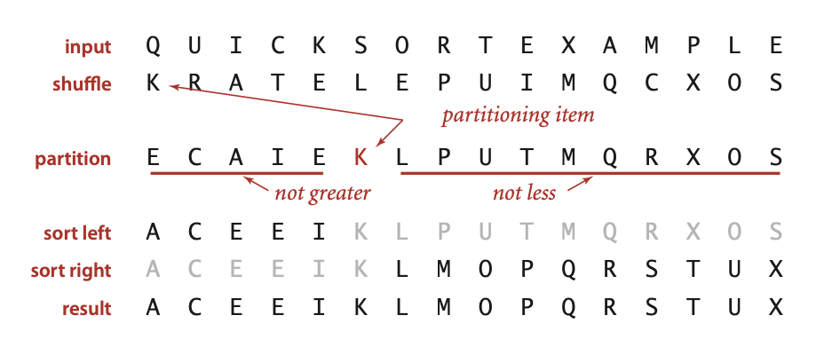
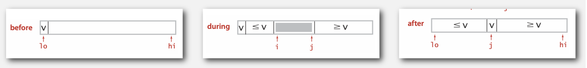
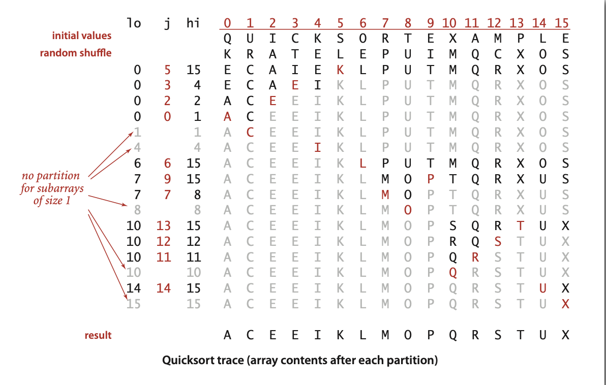
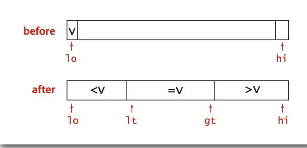
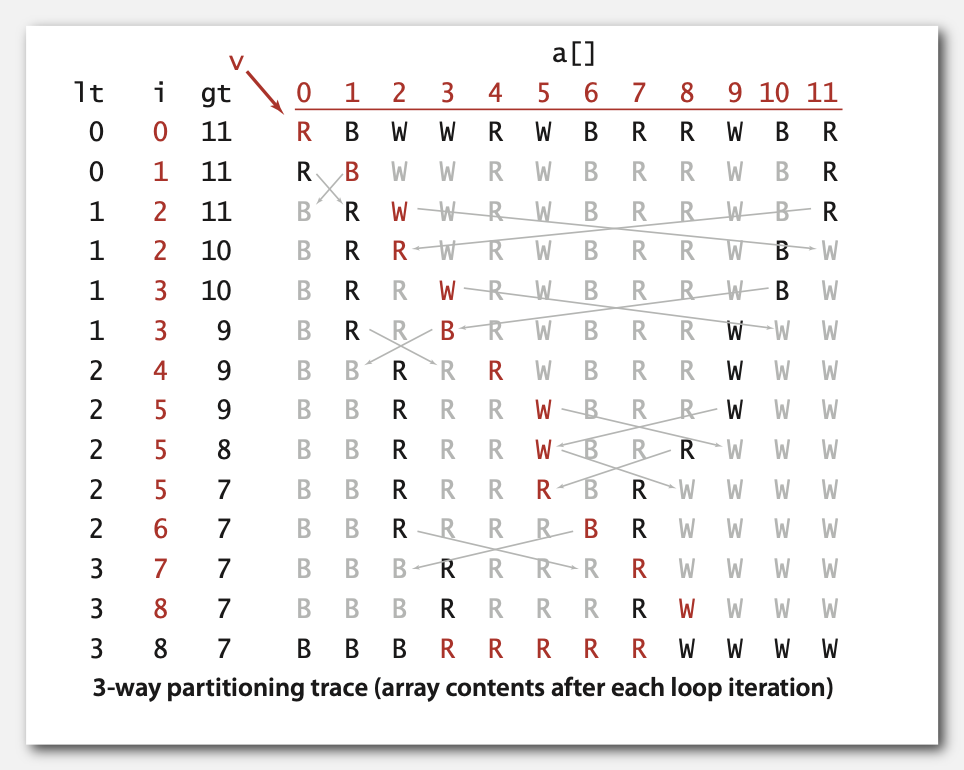
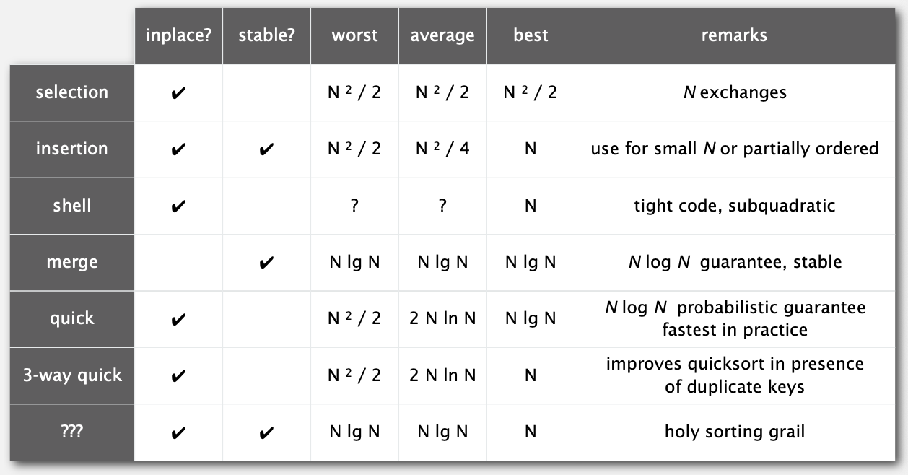

# 2.3 QUICKSORT

## quicksort

**Basic plan**

* 打乱数组
* 分割，找到点j
  * 确定j的位置
  * j左侧的条目都不大于j
  * j右侧的条目都不小于j

* 将分割后的两侧递归排序

过程如下：



**重复如下过程，直到i与j交叉**

* 将i从左向右扫描，直到找到a[i] >= a[lo]

* 将j从右向左扫描，直到找到a[j] <= a[lo]
* 交换a[i]与a[j]

> lo指向第一个元素，hi指向最后一个元素

java实现分割代码：

```java
private static int partition(Comparable[] a, int lo, int hi) {
    int i = lo, j = hi+1;									
    while (true) {
        while (less(a[++i], a[lo]))		
            if (i == hi) break;						// 找到左侧需要交换的条目
        while (less(a[lo], a[--j])) 
            if (j == lo) break;						// 找到右侧需要交换的条目
        if (i >= j) break;	              // 判断i、j是否交叉
        exch(a, i, j);                    // 交换
    }
    exch(a, lo, j);                       // 交换边界的元素
    return j;                             // 返回当前的边界下标
}
```



Java实现排序代码：

```java
private static int partition(Comparable[] a, int lo, int hi)
{  /* see previous slide */  }
public static void sort(Comparable[] a) {
    StdRandom.shuffle(a);                  // 为保证性能而进行洗牌
    sort(a, 0, a.length - 1); }
private static void sort(Comparable[] a, int lo, int hi) {
     if (hi <= lo) return;
     int j = partition(a, lo, hi); 
     sort(a, lo, j-1);
     sort(a, j+1, hi);
}
```

完整的排序过程：



最优时间复杂度为$\text~NlgN$

最坏时间复杂度为$\text~1/2N^2$

平均时间复杂度为$\text~1.39NlogN$

排序前进行洗牌算法，是为了避免最坏时间复杂度

### practical improvements

快速排序是原地排序算法，但是不稳定。

**对小数组进行排序**

在数组元素为10以下，使用插入排序。

```java
private static void sort(Comparable[] a, int lo, int hi) {
    if (hi <= lo + CUTOFF - 1) {
        Insertion.sort(a, lo, hi);
        return; 
    }
    int j = partition(a, lo, hi); 
    sort(a, lo, j-1);
    sort(a, j+1, hi);
}
```

## selection

**Goal.** 一个大小为N的数组，找到第k小的元素。

**Ex.** Min(k = 0), max(k = N - 1), median(k = N/2)

**quick-select**

也使用快速排序的分割方式，但是不进行递归操作

```java
public static Comparable select(Comparable[] a, int k) {
    StdRandom.shuffle(a);
    int lo = 0, hi = a.length - 1;
    while (hi > lo) {
        int j = partition(a, lo, hi);
        if (j < k) lo = j + 1;
        else if (j > k) hi = j - 1;
        else return a[k];
    }
    return a[k];
}
```

Quick-select平均时间复杂度为线性时间。

最坏时间复杂度为$\text~1/2N^2$

## duplicate keys

归并排序在key重复时的表现介于$1/2NlogN$到$NlogN$之间

而快速排序在key重复时：

* 除非在相同的key上停止分割操作，否则算法的时间复杂度是二次的！

* 90年代的C用户在`qsort()`中发现了这个缺陷。

**Goal.**将数组分割成三部分

* 在`lt`与`gt`之间的元素与边界元素`v`相等
* `lt`左侧的元素都小于它本身
* `gt`右侧的元素都大于它本身



* 设`v`是分区项`a[lo]`
* `i`从左到右扫描
  - (a[i] < v): 交换`a[lt]`与`a[i]`;将`lt`与`i`的值+1
  - (a[i] > v): 交换`a[gt]`与`a[i]`;将`gt`的值-1
  - (a[i] == v): `i`的值+1



Java代码实现：

```java
private static void sort(Comparable[] a, int lo, int hi) {     
    if (hi <= lo) return;
    int lt = lo, gt = hi;
    Comparable v = a[lo];
    int i = lo;
    while (i <= gt) {
        int cmp = a[i].compareTo(v);
        if (cmp < 0) exch(a, lt++, i++);
        else if (cmp > 0) exch(a, i, gt--);
        else i++;
    }
    sort(a, lo, lt - 1);
    sort(a, gt + 1, hi);
}
```

**Sorting lower bound.**如果存在$n$个不同的键，并且第$i$个键出现$x_i$次，则在最坏的情况下，任何基于比较的排序算法必须使用至少
$$
lg(\frac{N!}{x_1!x_2!...x_n!}) \text{~} -\sum_{i=1}^{n}x_ilg\frac{x_i}{n}
$$
次比较。

## Sorting summary



