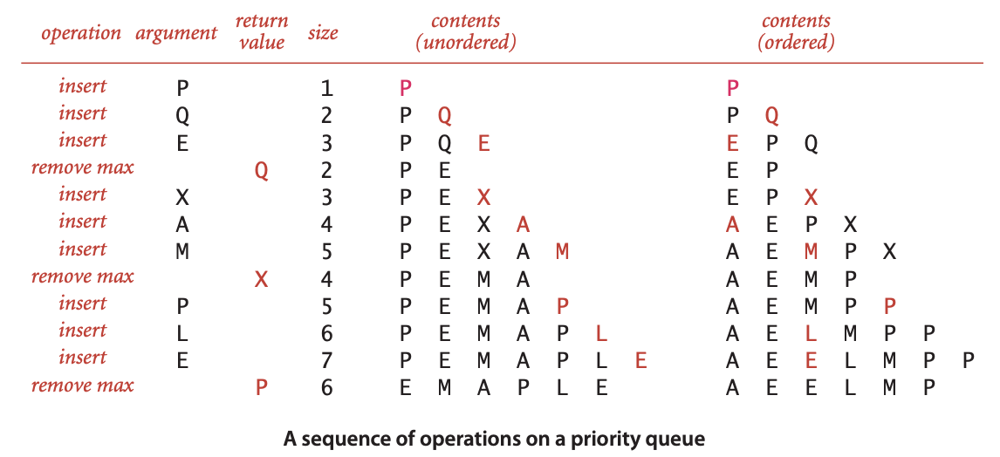
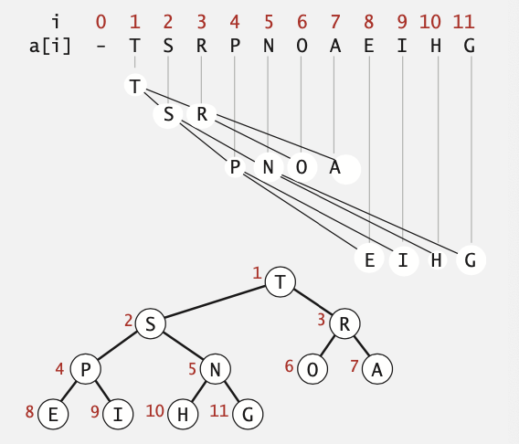
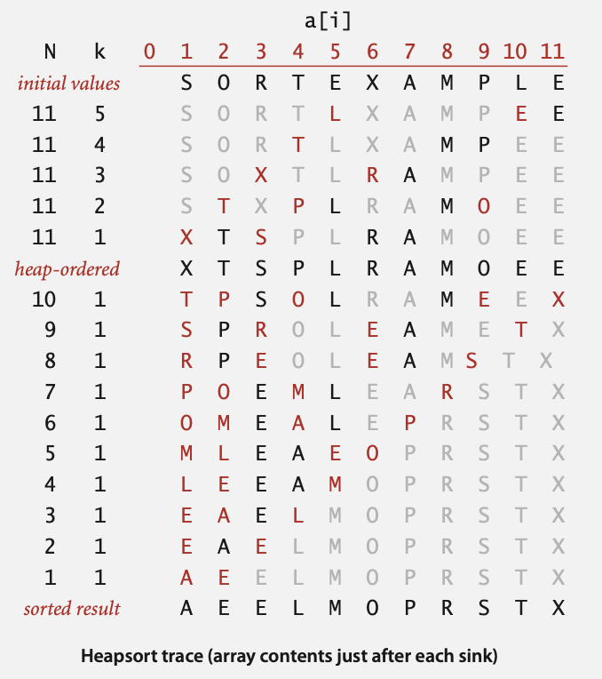

# 2.4 PRIORITY QUEUES

## API and elementary implementations

**集合类型.**删除元素规则

* **Stack.** 删除最近添加的元素
* **Queue.**删除最早添加的元素
* **Randomized queue.** 随机删除元素
* **Priority queue.** 删除最大或最小的元素

```java
public class MaxPQ<Key extands Comparable<Key>>
             MaxPQ()                  创建一个空的优先队列
             MaxPQ(Key[] a)        使用传入的key创建一个优先队列
        void insert(Key v)            在优先队列中插入key
         Key delMax()                 返回并删除最大的key
     boolean isEmpty()                   队列是否为空
         Key max()                       返回最大的key
         int size()                     队列中有多少元素
```

 ### 有序与无序数组的实现方式



### 使用无序数组的java实现

```java
public class UnorderedMaxPQ<Key extends Comparable<Key>> {
    private Key[] pq;   // pq[i] = ith element on pq
    private int N;      // number of elements on pq
    public UnorderedMaxPQ(int capacity) {  
        pq = (Key[]) new Comparable[capacity];  
    }
    public boolean isEmpty() {  
        return N == 0; 
    }
    public void insert(Key x) {  
        pq[N++] = x;  
    }
    public Key delMax() {
        int max = 0;
        for (int i = 1; i < N; i++)
            if (less(max, i)) max = i;
        exch(max, N-1);
        return pq[--N]; 
    }
}
```

### 各个操作所需的时间

| implementation  | insert | del max |  max  |
| :-------------: | :----: | :-----: | :---: |
| unordered array |   1    |    N    |   N   |
|  ordered array  |   N    |    1    |   1   |
|      goal       | log N  |  log N  | log N |

## binary heaps

### 完全二叉树

**二叉树.**每个结点最多只能有两棵子树，且有左右之分

**完整的树.**完美平衡，除了底部

N个节点的完整树的高度为$$\lfloor lgN \rfloor$$,仅当N为2的整数次幂时高度才会增加

### Binary heap 

二叉堆是完全二叉树或者是近似完全二叉树

父节点的值都大于子节点的值

**使用数组表示** 

* 下标从1开始
* 访问节点使用层序遍历
* 不需要明确链接

**可以使用数组下标访问任意节点**

* 节点k的父节点位置为k/2
* 节点k的左右孩子节点的位置为分别为2k与2k+1



### Promotion in a heap

**场景:**如果子节点中的key值比父节点大

* 交换父子节点的值

* 重复直到堆顺序恢复

```java
private void swim(int k) {
    while(k > 1 && less(k/2, k)) {
        exch(k, k/2);
        k = k/2;
    }
}
```

### Insertion in a heap

**Insert.**在末尾添加节点，然后将其上浮(swin())

**Cost.**最多比较$1+lgN$次

```java
public void insert(Key x) {
    pq[++N] = x;
    swim(N);
}
```

### Demotion in a heap

**场景:**如果父节点的值比子节点中的一个或两个值要小。

* 交换父节点与值较大的子节点的值
* 重复直到堆顺序恢复

```java
private void sink(int k) {
    while(2*k <= N) {
        int j = 2 * k;
        if (j < N && less(j, j+1)) j++;
        exch(k, j);
        k = j;
    }
}
```

### Delete the maximum in a heap

**Delete max.** 交换根节点与末尾的节点，然后将新的根的值下沉。

**Cost.** 最多进行$2lgN$次比较

```java
public Key delMax() {
    Key max = pq[];
    exch(1, N--);
    sink(1);
    pq[N+1] = null;
    return max;
}
```

### Java实现

```java
public class MaxPQ<Key extends Comparable<Key>> {
    private Key[] pq;
    private int N;
    
    public MaxPQ(int capacity) {  
        pq = (Key[]) new Comparable[capacity+1];  
    }
    
    public boolean isEmpty() {   
        return N == 0;   
    }
    public void insert(Key key)
    public Key delMax()
    {   /* see previous code */  }
    private void swim(int k)
    private void sink(int k)
    {   /* see previous code */  }
    private boolean less(int i, int j) { 
        return pq[i].compareTo(pq[j]) < 0; 
    } 
    private void exch(int i, int j) { 
        Key t = pq[i]; pq[i] = pq[j]; pq[j] = t; 
    }
}
```

### 优先级队列各实现操作开销总结

| implementation  | insert | del max | max  |
| :-------------: | :----: | :-----: | :--: |
| unordered array |   1    |    N    |  N   |
|  ordered array  |   N    |    1    |  1   |
|  binary array   |   N    |    1    |  1   |
|   d-ary heap    | log N  |  log N  |  1   |
|    Fibonacci    |   1    | log N + |  1   |
|   impossible    |   1    |    1    |  1   |


## Heapsort

原地排序基础计划

* 使用N个key创建大顶堆
* 然后重复删除最大值

**First pass.** 使用自下向上方法创建大顶堆

```java
for (int k = N/2; k >= 1; k--) 
    sink(a, k, N)
```

**Second pass.** 

* 删除值最大的节点
* 留在数组中，而不是置为空

```java
while(N > 1) {
    exch(a, 1, N--);
    sink(a, 1, N);
}
```

### java 实现

```java
public class Heap {
    public static void sort(Comparable[] a) {
        int N = a.length;
        for (int k = N/2; k >= 1; k--)
            sink(a, k, N);
        while (N > 1)
        {
            exch(a, 1, N);
            sink(a, 1, --N); }
    }
    private static void sink(Comparable[] a, int k, int N)
    {  /* as before */  }

    private static boolean less(Comparable[] a, int i, int j)
    {  /* as before */  }
    
    private static void exch(Comparable[] a, int i, int j)
    {  /* as before */  }
}
```

一次完整的堆排序：



### 排序算法总结

|             | inplace? | stable? |  worst  | average |  best   |                       remarks                       |
| :---------: | :------: | :-----: | :-----: | :-----: | :-----: | :-------------------------------------------------: |
|  selection  |    x     |         | $N^2/2$ | $N^2/2$ | $N^2/2$ |                     N exchanges                     |
|  insertion  |    x     |    x    | $N^2/2$ | $N^2/4$ |    N    |         use for small N or partially orderd         |
|    shell    |    x     |         |    ?    |    ?    |    N    |               tight code,subquadratic               |
|    quick    |    x     |         | $N^2/2$ | $2NlnN$ | $NlgN$  | N log N probabilistic guarantee fastest in practice |
| 3-way quick |    x     |         | $N^2/2$ | $2NlnN$ |    N    |  improves quicksort in presence of duplicate keys   |
|    merge    |          |    x    | $NlgN$  | $NlgN$  | $NlgN$  |              N log N guarantee, stable              |
|    heap     |    x     |         | $2NlgN$ | $2NlgN$ | $NlgN$  |             N log N guarantee, in-place             |
|     ???     |    x     |    x    | $NlgN$  | $NlgN$  | $NlgN$  |                 holy sorting grail                  |


