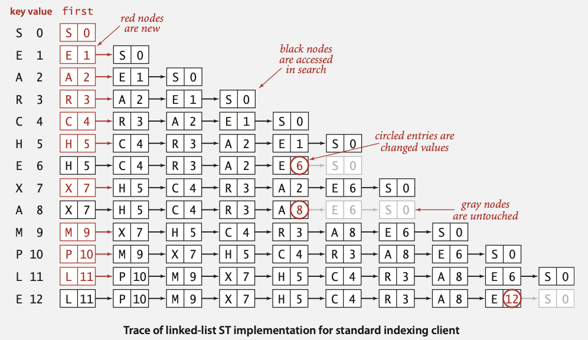
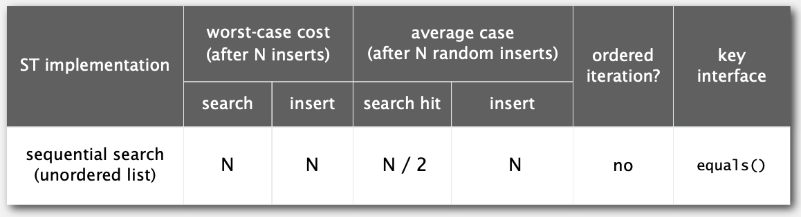
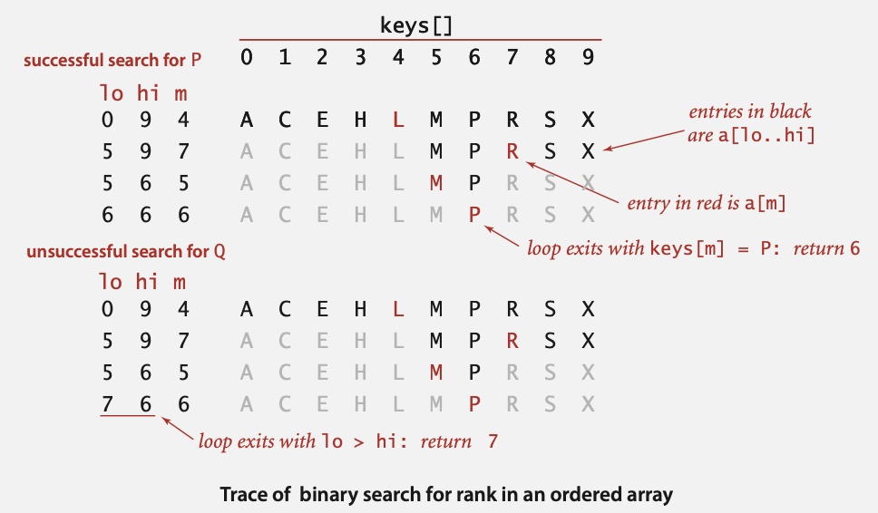
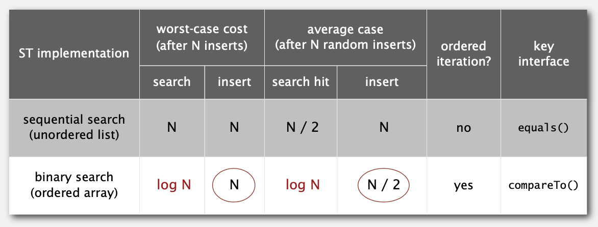
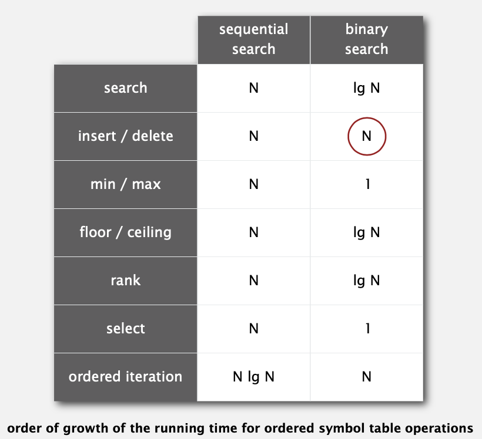

# 3.1 SYMBOL TABLES

## API

**Basic symbol table API**

```java
public class ST<Key, Value>
-------------------------------------------------------------------------
              ST()                       创建一个符号表
         void put(Key key, Value val)    将键值对放入符号表
                                        （如果value为null，则删除该key）
        Value get(Key key)               获取key对应的val
         void delete(Key key)            删除key和val
      boolean contains(Key key)          符号表是否包含这个key
      boolean isEmpty()                  符号表是否为空
          int size()                     符号表存储元素个数
Iterable<Key> keys()                     符号表中所有的key
```

**Conventions**

* 值不能为`null`
* `get()`方法在key不存在时返回`null`
* `put()`方法将新值会覆盖旧值

`contains()`方法实现：

```java
public boolean contains(Key key) {
    return get(key) != null;
}
```

`delete()`一种简陋实现：

```java
public void delete(Key key) {
    put(key, null);
}
```

## elementary implementations

### 单链表实现方式

**Data structure.** 维护一个无序的键值对单链表

**search.** 扫描所有的key直到匹配上

**insert.** 扫描所有的key直到匹配上;如果没找到则在表头添加



**ST总结**



### 有序数组中使用二分查找实现方式

**Data structure.** 维护一个有序的键值对数组



**java实现**

```java
public Value get(Key key) {
    if (isEmpty()) return null;
    int i = rank(key);
    if (i < N && keys[i].compareTo(key) == 0) return vals[i];
    else return null;
}
private int rank(Key key) {           //number of keys < key
    int lo = 0, hi = N-1;
    while (lo <= hi) {
        int mid = lo + (hi - lo) / 2;
        int cmp = key.compareTo(keys[mid]);
        if (cmp < 0) hi = mid - 1;
        else if (cmp > 0) lo = mid + 1;
        else if (cmp == 0) return mid
    }
    return lo; 
}

```

**缺点** 在插入key时，比key大的元素都需要向后移



## ordered operations

需要有序符号表的情况：

```
  keys    values
--------------------
09:00:00  Chicago      
09:00:03  Phoenix
09:00:13  Houston
09:00:59  Chicago
09:01:10  Houston
09:03:13  Chicago
09:10:11  Seattle
09:10:25  Seattle
09:14:25  Phoenix
09:19:32  Chicago
09:19:46  Chicago
09:21:05  Chicago
09:22:43  Seattle
09:22:54  Seattle
09:25:52  Chicago
09:35:21  Chicago
09:36:14  Seattle
09:37:44  Phoenix
```

有序符号表API:

```java
public class ST<Key extends Comparable<Key>, Value>
--------------------------------------------------------------------------------
              ST()                       create an ordered symbol table
         void put(Key key, Value val)    put key-value pair into the table
                                         (remove key from table if value is null)
        Value get(Key key)               value paired with key
                                         s(null if key is absent)
         void delete(Key key)            remove key (and its value) from table
      boolean contains(Key key)          is there a value paired with key?
      boolean isEmpty()                  is the table empty?
          int size()                     number of key-value pairs
          Key min()                      smallest key
          Key max()                      largest key
          Key floor(Key key)             largest key less than or equal to key
          Key ceiling(Key key)           smallest key greater than or equal to key
          int rank(Key key)              number of keys less than key
          Key select(int k)              key of rank k
         void deleteMin()                delete smallest key
         void deleteMax()                delete largest key
          int size(Key lo, Key hi)       number of keys in [lo..hi]
Iterable<Key> keys(Key lo, Key hi)       keys in [lo..hi], in sorted order
Iterable<Key> keys()                     all keys in the table, in sorted order
```

有序符号表总结



