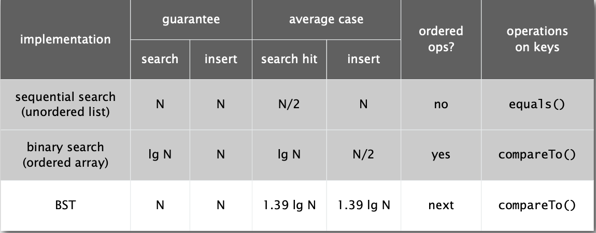
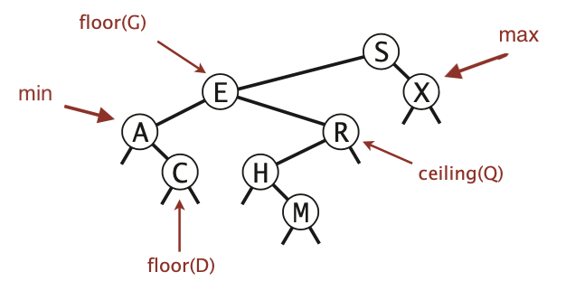

# 3.2 BINARY SEARCH TREES

## BSTs

它或者是一棵空树，或者是具有下列性质的二叉树： 若它的左子树不空，则左子树上所有结点的值均小于它的根结点的值； 若它的右子树不空，则右子树上所有结点的值均大于它的根结点的值； 它的左、右子树也分别为二叉搜索树。

### 在java中的数据结构

一个节点中包含：

* Key和Value
* 左子树与右子树的引用

```java
private class Node {
    private Key key;
    private Value val;
    private Node left, right;
    public Node(Key key, Value val) {
        this.key = key;
        this.val = val;
    }
}
```

```java
public class BST<Key extends Comparable<Key>, Value> {
    private Node root;
    
    private class Node 
    {/* see previous slide */}
    
    public void put(Key key, Value val) 
    {/* see next slides */}
    
    public Value get(Key key)
    {/* see next slides */}
    
    public void delete(Key key) 
    {/* see next slides */}
    
    public Iterable<Key> iterator()
    {/* see next slides */}
}
```

**Search.**如果小于当前节点，则继续向左搜索，如果大于当前节点，则继续向右搜索，如果相等，则成功搜索到。

**Insert.**与搜索的步骤相同，如果接下来搜索的节点为空，则插入在该位置。

**Get.**根据传入的Key返回对应的值，如果Key不存在，则返回null。

```java
public Value get(Key key) {
    Node x = root;
    while (x != null) {
        int cmp = key.compareTo(x.key);
        if      (cmp < 0) x = x.left;
        else if (cmp > 0) x = x.right;
        else if (cmp == 0) return x.val;
    }
    return null;
} 
```

**Cost.**搜索的次数为节点深度+1

**Put.**如果key存在，则对value重新赋值；如果不存在，则插入新节点

```java
public void put(Key key, Value val) {
    root = put(root, key, val);
}
private Node put(Node x, Key key, Value val) {
    if (x == null) return new Node(key, val);
    int cmp = key.compareTo(x.key);
    if.     (cmp < 0)
        x.left = put(x.left, key, val);
    else if (cmp > 0) 
        x.right = put(x.right, key, val);
    else if (cmp == 0)
        x.val = val;
    return x;
}
```

### BSTs: 数学分析

如果N个不同的key的节点以随机的顺序进行插入操作，那么形成的树的搜索/插入操作的比较次数为$\text{~}2lnN$ (与快速排序的分区操作对应)

### 总结



## ordered operations

**Minimum.**表中最小的值

**Maximum.**表中最大的值

**Floor.**表中比给定key小的最大key

**Ceiling.**表中比给定key大的最小key



### 计算floor

**情况1** k与root的key相等

k的floor就是k

**情况2** k小于root的key

k的floor在左子树中

**情况3** k大于root的key

k的floor在右子树中

```java
public Key floor(Key key) {
    Node x = floor(root,key);
    if (x == null)return null;
    return x.key;
}
private Node floor(Node x,Key key) {
    if(x == ull) return null;
    int cmp = key.compareTo(x.key);
    
    if(cmp == 0) return x;
    if(cmp < 0) return floor(x.left,key);
    
    Node t = floor(x.right,key);
    if (t != null) return t;
    else           return x;
}
```

### 子树个数

```java
private class Node {
    private Key key;
    private Value val;
    private Node left;
    private Node right;
    private int count;
}
```

```java
public int size() {
    return size(root);
}
private int size(Node x) {
    if (x == null) return 0;
    return x.count;
}
```

```java
private Node put(Node x, Key key, Value val) {
    if (x == null) return new Node(key, val, 1);
    int cmp = key.compareTo(x.key);
    if      (cmp  < 0) x.left  = put(x.left,  key, val);
    else if (cmp  > 0) x.right = put(x.right, key, val);
    else if (cmp == 0) x.val = val;
    x.count = 1 + size(x.left) + size(x.right);
    return x;
}
```

