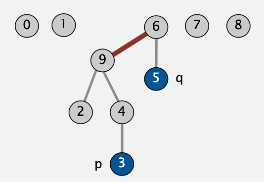

# Algorithms 4

## 1.5 UNION-FIND

### Quick-find

**Data Structure**

* 创建一个长度为N的数组
* p和q位置存储的id相同时，则认为p和q是相连的

```
      0 1 2 3 4 5 6 7 8 9
id[]  0 1 1 8 8 0 0 1 8 8
```


**Find**

判断pq是否相连，检查p与q的id是否相同。 

> id[6] **=** 0;id[1] **=** 1 6和1不是相连的

**Union**

要合并包含p和q的所有条目，需将所有id等于id [p]的条目都更改为id [q]。

```
      0 1 2 3 4 5 6 7 8 9
id[]  1 1 1 8 8 1 1 1 8 8		合并了6和1之后
			|					| |
			需要更所有条目
```


**implementation**

```java
public class QuickFindUF {
	private int[] id;
	
	public QuickFindUF(int N) {
		id = new int[N];
		for (int i = 0; i < N; i++)
			id[i] = i;
	}
	
	public boolean connected(int p, int q) {
		return id[p] == id[q];
	}
	
	public void union(int p, int q) {
		int pid = id[p];
		int qid = id[q];
		for (int i = 0; i < id.length; i++) {
			if (id[i] == pid) id[i] = qid;
		}
	}
}
```

**Cost model**

| algorithm  | initialize | union | find |
| :--------: | :--------: | :---: | :--: |
| quick-find |     N      |   N   |  1   |

时间复杂度为$ N^{2} $。

### Quick-union

**Data structure**

* 长度为N的数组id[]
* id[i]中存放的是i的父节点
* i的根节点为id[id[id[...id[i]...]]]

```
     0 1 2 3 4 5 6 7 8 9
id[] 0 1 9 4 9 6 6 7 8 9     
```

如下图中3的根节点为9，5的根节点是6，3与5不相连。


**Find**

判断pq是否相连，检查p与q的根节点是否相同。 

**Union**

要合并包含p和q的所有条目，需将p的根节点设置为q的根节点。

```
     0 1 2 3 4 5 6 7 8 9
id[] 0 1 9 4 9 6 6 7 8 6 
                       |
                 只需要修改这一项
```




**implementation**

```java
public class QuickFindUF {
	private int[] id;
	
	public QuickUnionUF(int N) {
		id = new int[N];
		for (int i = 0; i < N; i++)
			id[i] = i;
	}
  
  private int root(int i) {
    while (i != id[i]) i = id[i];
    return i
  }
  
	public boolean connected(int p, int q) {
		return root(p) == root(q);
	}
	
	public void union(int p, int q) {
		int i = root(p);
    int j = root(q);
    id[i] = j;
	}
}
```

**Cost model**

|  algorithm  | initialize | union | find |
| :---------: | :--------: | :---: | :--: |
| quick-find  |     N      |   N   |  1   |
| quick-union |     N      | $N^+$ |  N   |

合并操作中，多出的时间消耗`+`为寻找根节点的时间。

### Weighting quick-union

****

**Weighting quick-union**

* 优化quick-union避免树过高

* 追踪每棵树的大小

* 将小树的根链接到大树的根上

  

Quick-union与weighted后的对比：


**Data structure**

与quick-union相同，但是要多维护一个sz[i]的数组，来存放以i为根节点的树的大小。

**Find**

与quick-union相同 `return root(p)== root(q);`

**Union**

在quick-union的基础上修改：

* 将较小的树链接到大树上
* 更新sz[]数组

```java
int i = root(p);
int j = root(q);
if (i == j) return;
if (sz[i] < sz[j]) { id[i] = j; sz[j] += sz[i]; }
else 							 { id[j] = i; sz[i] += sz[j]; }
```

**Cost model**

|  algorithm  | initialize |    union     |    find    |
| :---------: | :--------: | :----------: | :--------: |
| quick-find  |     N      |      N       |     1      |
| quick-union |     N      |    $N^+$     |     N      |
| weighted QU |     N      | $log_2{N^+}$ | $log_2{N}$ |

### Path compression

**Quick union with path compression. **

在计算p的根结点后，将路径上涉及的根结点都指向p的最终根结点。


**implementation**

使路径中的每个其他节点都指向其根结点（从而将路径长度减半）。

```java
private int root(int i) {
	while(i != id[i]) {
		id[i] = id[id[i]];	// 只需添加这一行代码
		i = id[i]
	}
	return i;
}
```

**Cost model**

|           algorithm            | worst-cast time |
| :----------------------------: | :-------------: |
|           quick-find           |       M N       |
|          quick-union           |       M N       |
|          weighted QU           |   N + M log N   |
|      QU+path compression       |   N + M log N   |
| weighted QU + path compression |   N + M lg* N   |

