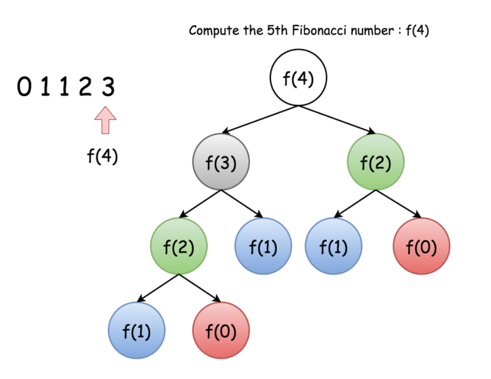
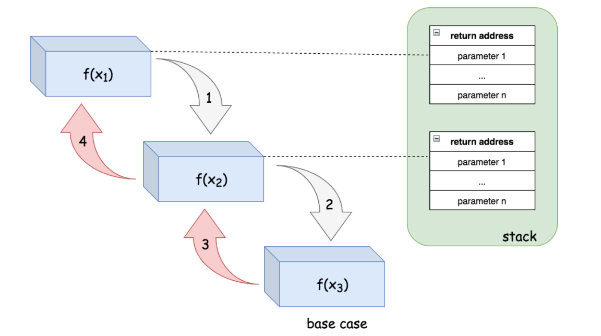
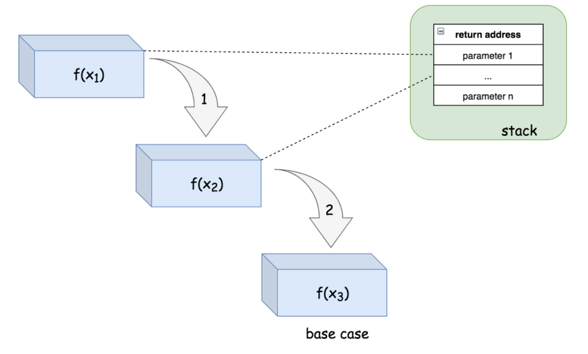

# Recursion

> 递归是一种将自身作为子例程调用的函数来解决问题的方法。

每次递归调用自身时，都是将给出的问题分解为更小的子问题。递归会一直调用直到问题无法再继续分解。

一个递归函数需要有以下两点来保证函数不会无限递归调用下去：

1. 一个基础案例(base cacse) -- 一个不使用递归来产生答案的终止方案。
2. 一系列规则，也称为递推关系(recurrence relation)，可将所有其他案例分解为基础案例。

**Example**

---

> 逆序打印字符串问题

首先，定义一个函数：`printReverse(str[0...n-1])`，`str[0]`代表字符串的第一个字符。然后将任务分解为两步：

1. `printReverse(str[1...n-1])`逆序打印子串`str[1...n-1]`
2. `print(str[0])`:打印字符串的第一个字符

代码如下：

```java
private static void printReverse(char [] str) {
  helper(0, str);
}

private static void helper(int index, char [] str) {
  if (str == null || index >= str.length) {
    return;
  }
  helper(index + 1, str);
  System.out.print(str[index]);
}
```

## Recurrence Relation

在实现一个递归函数之前，需要解决以下两点：

* 递推关系：问题的结果与子问题的结果
* 基本案例：无需任何进一步递归调用就可以直接计算答案的情况。 有时，基本案例也称为基础案例，如果认为将问题分为子问题是以自上而下的方式进行的话，这些基础案例通常是将问题缩小到最小规模（即底层）的案例。

> 当我们找到以上两个元素，实现递归函数只需要根据递推关系调用函数自身，直到子问题变为基础案例。


## Duplicate Calculation in Recursion

递归作为一个强大的算法解决方案，有时候也会有一些性能上的惩罚：重复计算。

以斐波那契数问题为例，递推关系为：
$$
F(n) = F(n-1) + F(n-2)
$$
基础案例为：
$$
F(0)=0,F(1)=1
$$
代码实现如下：

```java
public static int fibonacci(int n) {
  if (n < 2) {
    return n;
  } else {
    return fibonacci(n-1) + fibonacci(n-2);
  }
}
```

现在，如果想求出`F(4)`的结果，则上面的公式变成：
$$
F(4)=F(3)+F(2)=(F(2)+F(1))+F(2)
$$
在上述公式中可以看到，如果要计算`F(4)`，则需要计算两次`F(2)`。



### Memoization

---

为了消除上述情况中的重复计算，其中一种想法是将中间结果存储在缓存中，以便在之后的计算中重用，而无需重新计算。

这个想法也被称为_记忆化_，这是一种经常与递归一起使用的技术。

> [Memoization](https://en.wikipedia.org/wiki/Memoization) 是一种优化技术，当再次出现相同的输入时，通过返回之前**存储**的耗时函数计算出来的结果来**加速**计算机程序 。 

回到斐波那契问题，可以利用哈希表以`n`为key来存储计算后的`F(n)`的结果。这样则可以避免重复计算。记忆化技术是一个很好的例子，它演示了如何通过减少一些额外的空间来减少计算时间。

代码如下：

```java
import java.util.HashMap;

public class Main {

  HashMap<Integer, Integer> cache = new HashMap<Integer, Integer>();

  private int fib(int N) {
    // 如果缓存中有，则直接拿来用
    if (cache.containsKey(N)) {
      return cache.get(N);
    }
    int result;
    if (N < 2) {
      result = N;
    } else {
      // 递归调用求值，将问题分解
      result = fib(N-1) + fib(N-2);
    }
    // 将计算结果存入哈希表，作为缓存
    cache.put(N, result);
    return result;
  }
}
```


## Time Complexity

>给出一个递归算法，它的时间复杂度$O(T)$通常由**递归调用的次数**($R$)与**计算一次的耗时**($O(s)$)的乘积组成：
>$$
>O(T) = R * O(s)
>$$


### _Example_

----

在反序输出字符串的问题中， 使用递归解决问题时的地推关系如下：

`printReverse(str) = printReverse(str[1...n]) + print(str[0])`

`str[1...n]`是不包含`str[0]`的 `str`的子串。

如上方法会调用`n`次，`n`是输入字符串的长度。在每个递归的结尾打印第一个字符，因此每次操作的时间复杂度为$O(1)$。

将所有的操作加在一起就得出了`printReverse(str)`的时间复杂度应该是：
$$
O(printReverse) = n * O(1) = O(N).
$$


### _Execution Tree_

----

递归方法中，输入的大小很少有称线性增加的情况。例如斐波那契数字问题中，地推关系的定义为`f(n) = f(n - 1) +f(n - 2)`。乍一看并不能直观的计算出执行斐波那契函数的耗时。

> 这种情况下，最好使用`execution tree`来表示递归方法的操作流程。每个节点表示执行了一次递归操作。因此，节点的总数表示整个操作的递归次数。

一个递归方法的操作树是一颗`n-ary tree`，`n`表示在地推关系中递归的次数。例如，斐波那契数列方法将生成一个_**二叉树**_，下图展示了斐波那契数为`f(4)`的操作树：


因为一棵`n`层的满二叉树总共有$2^n-1$个节点。所以，`f(n)`递归的次数上界也应该是$2^n-1$。

因此可以估算出`f(n)`的时间复杂度为$O(2^n)$。


### _Memoization_

---

使用“记忆化”策略可以优化递归算法的时间复杂度。通过缓存中间过渡的计算结果来极大减少递归次数，即减少操作树的分支。在分析带有“记忆化”的递归算法的时间复杂性时，应该考虑到这种减少。

在斐波那契数列问题中，使用“记忆化”来记录每次操作的结果。这样可以确保每个斐波那契数都只被计算了一次。在地推关系中，斐波那契数`f(n)`是依赖于所有先前计算的`n-1`斐波那契数的。因此，每次计算`f(n)`时，都将调用`n-1`次递归来计算先前依赖的计算结果。

现在则可以使用$O(1)*n = O(n)$来表示时间复杂度了，“记忆化”不仅优化了递归算法的时间复杂度，也简化了时间复杂度的计算。


## Space Complexity

> 在计算递归算法的空间复杂度时，应主要考虑两部分空间消耗：`recursion related`(与递归相关的空间)和`non-recursion related space`(非递归相关的空间)。


### _Recursion Related Space_

---

递归相关空间是指递归直接产生的内存消耗，即递归函数调用的栈。为了完成一次函数调用，系统会在栈上开辟一些空间来保存三个重要的信息：

1. 函数调用的返回地址，当函数调用结束后，程序必须知道返回到哪。
2. 函数调用所需参数。
3. 函数调用中的局部变量。

堆栈中的这些空间是函数调用期间产生的最小开销。 一旦函数调用完成，该空间将被释放。

在递归算法中，该函数会依次调用，直到它们到达`base case`（a.k.a bottom case）为止。 这意味着用于每个函数调用的空间会累加在一起。

> 对于递归算法，如果没有其他内存消耗，则此递归产生的空间消耗将是该算法的空间上限。

例如反序输出字符串问题中，在递归调用外并没有产生额外的内存消耗，仅仅是打印字符。每次的递归调用都可以认为空间消耗为常量。由于该函数会调用`n`次，`n`也是字符串的长度。因此该递归算法的空间复杂度为$O(n)$。

为了说明这一点，对于一系列递归调用`f(x1)->f(x2)->f(x3)`，下图显示了执行步骤的顺序以及栈空间的布局：



为了调用`f(x2)`，将在栈中为`f(x1)`分配一块空间。 类似地，在`f(x2)`中，系统将为调用`f(x3)`分配另一个空间。 最后在`f(x3)`中，我们达到了`base case`，因此在`f(x3)`中没有进一步的递归调用。

由于与递归相关的空间消耗，有时可能会遇到称为堆栈溢出的情况，在这种情况下，为程序分配的堆栈达到其最大空间限制，并且程序崩溃。 因此，在设计递归算法时，应仔细检查输入扩大时是否有堆栈溢出的可能性。


### _Non-Recursion Related Space_

---

顾名思义，与递归无关的空间是指与递归没有直接关系的内存空间，通常为全局变量分配的空间（通常在堆中）。

无论递归与否，有些时候需要在调用后续函数之前将输入的数据存入全局变量中。也有可能需要将中间过渡的递归结果存储起来。分析空间复杂度时也需要将“记忆化”的全局变量开销考虑在内。


## Tail Recursion

尾递归作为一种特殊递归情况，可以免除上面提到的递归相关空间。

> **尾递归**是指在递归函数中，最后一句代码为递归调用，并且函数内只有**一个**递归调用

下面例子展示了尾递归与非尾递归的区别，在非尾递归的例子中，最后一句递归调用时还做了额外的计算。

```java
public class Main {
    
  private static int helper_non_tail_recursion(int start, int [] ls) {
    if (start >= ls.length) {
      return 0;
    }
    //  非尾递归，因为在递归函数返回后还做了其他计算
    return ls[start] + helper_non_tail_recursion(start+1, ls);
  }

  public static int sum_non_tail_recursion(int [] ls) {
    if (ls == null || ls.length == 0) {
      return 0;
    }
    return helper_non_tail_recursion(0, ls);
  }

  //---------------------------------------------

  private static int helper_tail_recursion(int start, int [] ls, int acc) {
    if (start >= ls.length) {
      return acc;
    }
    // 尾递归，因为最后一句话仅仅调用了递归函数
    return helper_tail_recursion(start+1, ls, acc+ls[start]);
  }
    
  public static int sum_tail_recursion(int [] ls) {
    if (ls == null || ls.length == 0) {
      return 0;
    }
    return helper_tail_recursion(0, ls, 0);
  }
}
```

尾部递归的好处在于，它可以避免递归调用期间每次都要开辟新的栈空间，因为系统可以为每个递归调用在栈中重用固定数量的空间。

如果使用尾递归，那么`f(x1) -> f(x2) -> f(x3)`递归调用链的栈布局则变为：



在尾递归中，从递归调用返回后，后续所有函数也将立即返回，因此我们可以跳过返回的整个递归调用链，直接返回到最初的调用者。 这意味着不需要所有递归函数的调用栈，从而节省了空间。

在第一步中，为了调用`f(x2)`，将在栈中为`f(x1)`分配一块空间。 第二部中，`f(x2)`会递归调用`f(x3)`。而然，为了第二次调用，系统会复用之前开辟的栈空间而不是重新开辟新的空间。最后，在`f(x3)`到了基础案例，函数也将直接返回到最初调用者，而不用返回之前的每一步调用者。

尾递归函数可以作为非尾递归函数执行，即使用成堆的调用栈执行，而不会影响结果。 通常，编译器会识别尾部递归模式并优化。 但是，并非所有的编程语言都支持此优化。 例如，C/C ++支持优化尾递归函数。 而Java和Python不支持尾递归优化。