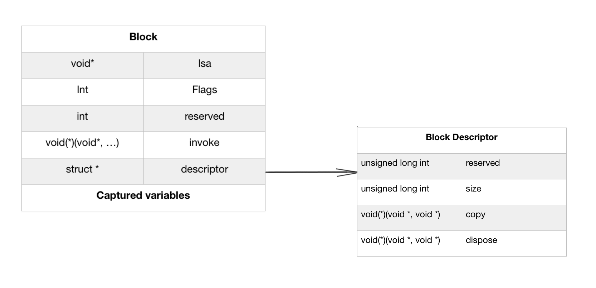
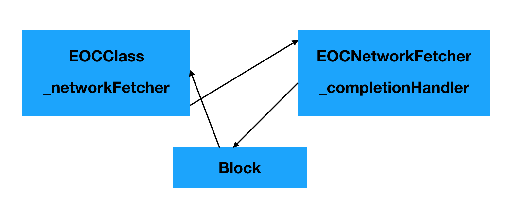
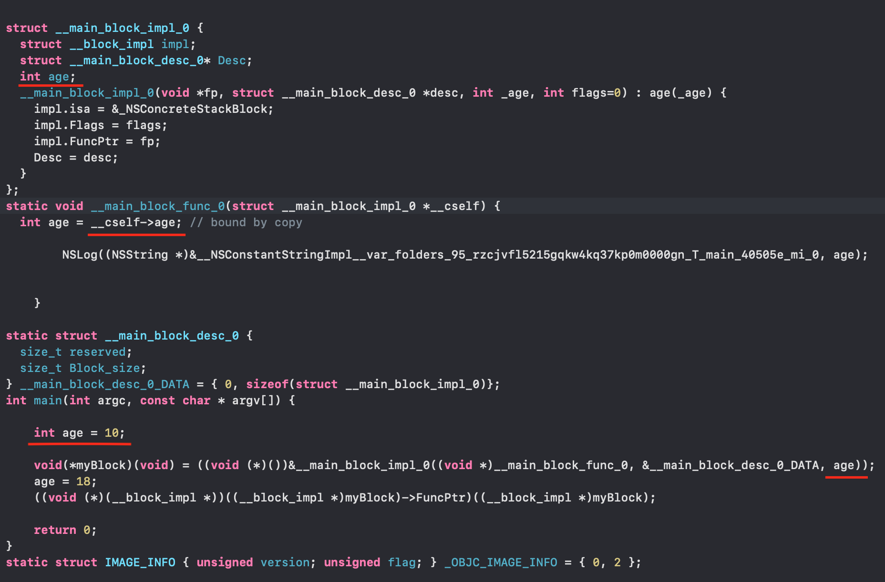
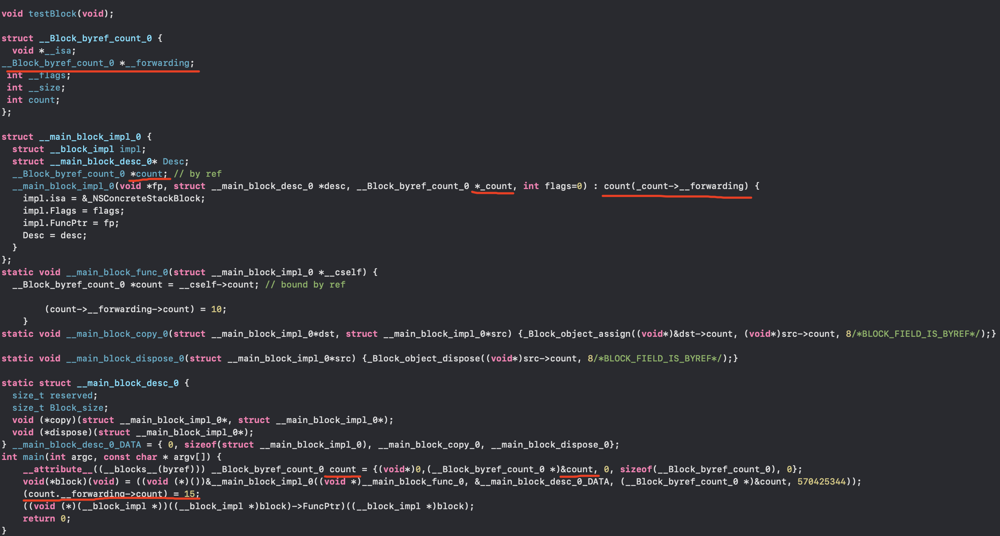
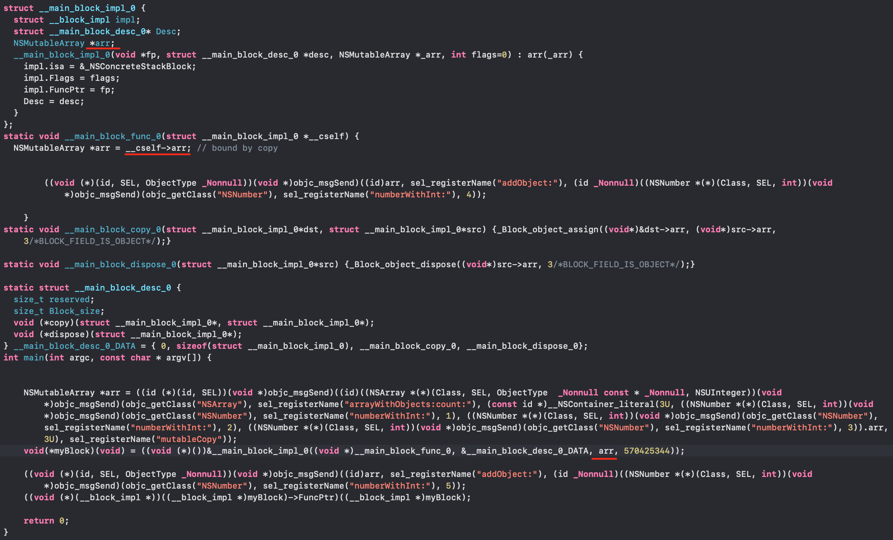
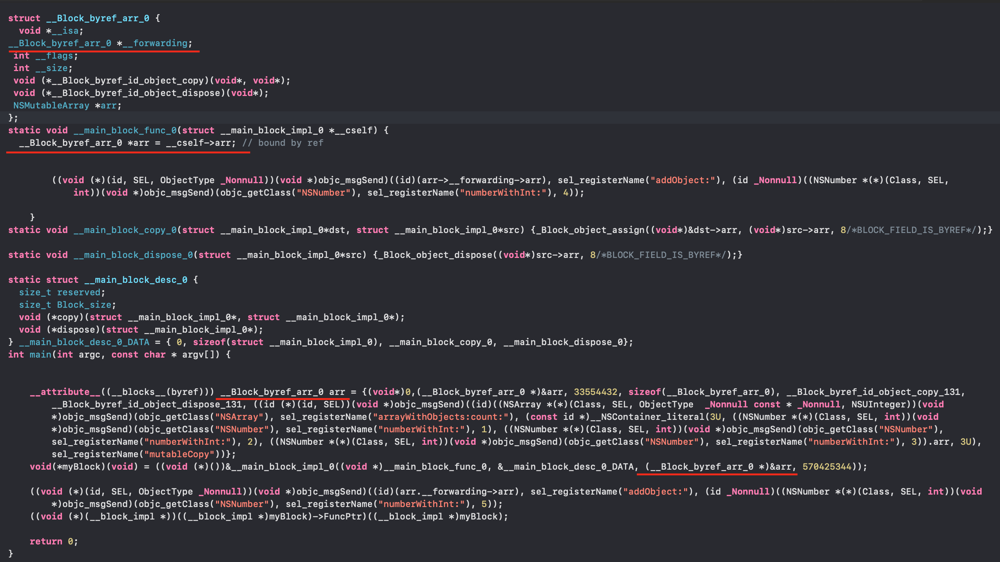

# Block

## 理解Block

### 基础

一个最基本的`block`长这样：

```objectivec
^{
  // Block需要做xxx
}
```

`block`也可以作为一个变量使用，而一个没有参数也没有返回值的`block`大概长这样：

```objectivec
void (^someBlock)(void) = ^{
  // Block需要做xxx
}
```

上面的代码定义了一个叫做`someBlock`的`block`，语法有些奇怪，可以总结成这样：

```objectivec
return_type (^block_name)(parameters)
```

定义一个返回值为`int`类型，参数为2个`int`类型的`block`：

```objectivec
int (^addBlock)(int a, int b) = ^(int a, int b){
  return a+b;
}
```

`block`可以作为函数使用，因此可以这样调用刚才的`addBlock`:

```objectivec
int add = addBlock(2, 5) // add = 7
```

在`block`中可以截获外部定义的变量：

```objectivec
int additional = 5;
int (^addBlock)(int a, int b) = ^(int a, int b) {
  return a + b + additional;
};
int add = addBlock(2, 5); // add = 12
```

然而外部定义的变量，在`block`中只能使用无法更改，如果强行更改编译器会报错，如果需要更改外部变量的值，就必须在声明变量的前面加上`__block`。

```objectivec
__block int additional = 5;
int (^addBlock)(int a, int b) = ^(int a, int b) {
  additional += 1;
  return a + b + additional;
};
int add = addBlock(2, 5); // add = 13
```

`block`在截获一个对象的时候，也会持有这个对象。而这个对象会在`block`释放的时候才会随着释放。`blcok`其实也是一个对象，所以也使用引用计数方式管理内存。如果`block`定义在一个OC的类中，那么`self`会跟随着每个这个类的实例变量。而实例变量不需要明确添加`__block`，但是如果实例变量进行读写操作时被`block`截获，那么`self`也会被截获，举个例子：

```objectivec
- (void)anInstanceMethod {
  //...
  void(^someBlock) = ^{
    _anInstanceVariable = @"something";
    NSLog(@"_anInstanceVariable = %@", _anInstanceVariable);
  };
  //...
}
```

如果A类中有一个这样的对象方法，那么当调用时`self`其实也被捕获了，因为访问实例变量的时候，等同于以下写法：

```objectivec
self->_anInstanceVariable = @"something";
```

而成员变量(property)则可以清楚的看到`self`:

```objectivec
self.aProperty = @"something";
```

`self`会被截获并持有的情况需要注意，因为可能会引起循环引用。

### 进阶

`block`的内存布局：



#### 底层结构

```
struct __block_impl {
	void *isa;
	int Flags;
	int Reserved;
	void *FuncPtr;
};
```

其中最重要的是`invoke`，指向`block`的实现存放处的函数指针。该函数至少含有一个`void*`,也就是`block`自身。`block`其实也就是一个匿名函数指针,将以前使用标准C语言功能完成的操作包装的更简洁易用。

`descriptor`是一个指向结构体的指针，声明了`block`对象的整体大小以及用于复制和处理助手的函数指针。这些助手往往在`block`捕获对象时进行持有、释放操作时起到作用。

一个`block`包含所有的被截获的对象的副本。这些副本存储在`descriptor`之后，并占用存储所有捕获变量所需的空间。注意，这并不意味着对象本身被复制，并且还包含变量的指针。运行`block`时，将从该内存区域读取捕获的变量，这就是为什么需要将该`block`作为参数传递到`invoke`函数的原因。

### 全局、栈和堆中的Block

Block的类型分为以下三张情况：

* 没有访问auto变量--GlobalBlock

* 访问auto变量--__NSStackBlock__

* 对StackBlock执行了copy操作--__NSMallocBlock__

```objective-c
void(^block)();
int count = 0;
if (/*some condition*/) {
  	block = ^{
        NSLog(@"Count is : %d", count);
    };
} else {
		block = ^{
        NSLog(@"Count is : %d", count);
    };
}
block();
```

这两个`block`定义在`if-else`语句中，并且存放在栈内存中，当为每个`block`分配堆栈内存时，编译器可以在分配该内存的作用域末尾自由覆盖该内存。 因此，保证每个块仅在其各自的if语句部分内有效。 这段代码编译可以通过，但在运行时可能会崩溃。如果系统没有重写这段`block`所占用的内存，则该代码将运行而不会出错，反之，肯定会发生崩溃。

在没有覆盖时，通过`lldb`中打印出block的类型：

```
(lldb) po object_getClassName(block)
"__NSStackBlock__"
```

在出现内存被覆盖时，则打印出来的结果并不是我们想要的：

```
(lldb) po object_getClassName(block)
2jOT62Sv9
```

而向这个`block`发送`copy`消息，则可以将`block`从栈内存复制到堆内存中，这样`block`则可以在定义的作用域外被使用。这个`block`也跟其他的OC对象一样使用引用计数管理内存，当引用计数为0时，则会释放。

```objective-c
void(^block)();
int count = 0;
if (/*some condition*/) {
  	block = [^{
      	NSLog(@"Count is : %d", count);
    } copy];
} else {
		block = [^{
      	NSLog(@"Count is : %d", count);
    } copy];
}
block();
```

此时，block的类型也随之改变：

```
(lldb) po object_getClassName(block)
"__NSMallocBlock__"
```

这样代码就安全了。

以上情况，都是发生在`MRC`下，`ARC`时，编译器帮我们做了很多优化。同样的代码：

```objective-c
void(^block)();
int count = 0;
if (/*some condition*/) {
  	block = ^{
        NSLog(@"Count is : %d", count);
    };
} else {
		block = ^{
        NSLog(@"Count is : %d", count);
    };
}
block();
```

当我们再次打印block的类型时：

```
(lldb) po object_getClassName(block)
"__NSMallocBlock__"
```

这时，block类型由`__NSStackBlock__`变为`__NSMallocBlock__`。

从汇编代码可以看到：

```
Demo`testBlock:
    0x100000d80 <+0>:   pushq  %rbp
    0x100000d81 <+1>:   movq   %rsp, %rbp
    0x100000d84 <+4>:   subq   $0x60, %rsp
    0x100000d88 <+8>:   movq   $0x0, -0x8(%rbp)
    0x100000d90 <+16>:  movq   $0x0, -0x28(%rbp)
    0x100000d98 <+24>:  leaq   -0x28(%rbp), %rax
    0x100000d9c <+28>:  movq   %rax, -0x20(%rbp)
    0x100000da0 <+32>:  movl   $0x20000000, -0x18(%rbp)  ; imm = 0x20000000 
    0x100000da7 <+39>:  movl   $0x20, -0x14(%rbp)
    0x100000dae <+46>:  movl   $0x0, -0x10(%rbp)
    0x100000db5 <+53>:  movq   0x244(%rip), %rcx         ; (void *)0x00007fff8e49b4c0: _NSConcreteStackBlock
    0x100000dbc <+60>:  movq   %rcx, -0x50(%rbp)
    0x100000dc0 <+64>:  movl   $0xc2000000, -0x48(%rbp)  ; imm = 0xC2000000 
    0x100000dc7 <+71>:  movl   $0x0, -0x44(%rbp)
    0x100000dce <+78>:  leaq   0x8b(%rip), %rcx          ; __testBlock_block_invoke at main.m:24
    0x100000dd5 <+85>:  movq   %rcx, -0x40(%rbp)
    0x100000dd9 <+89>:  leaq   0x240(%rip), %rcx         ; __block_descriptor_40_e8_32r_e5_v8?0l
    0x100000de0 <+96>:  movq   %rcx, -0x38(%rbp)
    0x100000de4 <+100>: movq   %rax, -0x30(%rbp)
    0x100000de8 <+104>: leaq   -0x50(%rbp), %rdi
    0x100000dec <+108>: callq  0x100000f1c               ; symbol stub for: objc_retainBlock
    0x100000df1 <+113>: movq   -0x8(%rbp), %rdi
    0x100000df5 <+117>: movq   %rax, -0x8(%rbp)
    0x100000df9 <+121>: movq   0x210(%rip), %rax         ; (void *)0x00007fff66bde660: objc_release
    0x100000e00 <+128>: callq  *%rax
->  0x100000e02 <+130>: movq   -0x8(%rbp), %rax
```

系统先是定义了`_NSConcreteStackBlock`类型的变量，然后对该对象调用了`objc_retainBlock`的方法，而在OC源码中，也可以看到该方法的实现，字面意思看出是执行了`copy`操作：

```
id objc_retainBlock(id x) {
    return (id)_Block_copy(x);
}
```

这个方法会返回一个类型为`__NSMallocBlock__`的对象。由此可见，`ARC`会自动帮我们将栈block拷贝到堆内存当中。

而没有捕获外部变量时称为全局block:

```objective-c
int main(int argc, const char * argv[]) {
  	void(^block2)(void) = ^{
    	NSLog("This is __NSGlobalBlock__");
		};
    block2();
    return 0;
}
```

通过lldb可以看到block的类型：

```
(lldb) po object_getClassName(block)
"__NSGlobalBlock__"
```


## 使用typedefs

`block`也可以当作变量使用

```objective-c
^(BOOL flag, int value) {
  	if (flag) {
      	return value *5;
    } else {
      	return value *10;
    }
}

//以上是一个普通的block，现在将它赋值给某个变量

int (^variableName)(BOOL flag, int value) = ^(BOOL flag, int value) {
  	// Implementation
  	return someInt;
}
```

以上的写法虽然与普通的数据类型不一样，但是看起来很像函数指针。为了让繁琐的`block`类型看起来简洁一些，可以使用C语言中的类型定义`typedefs`。我们可以这样定义一个新的类型：

```objective-c
typedef int(^EOCSomeBlock)(BOOL flag, int value);
```

这样就定义了一个新的类型`EOCSomeBlock`,而在使用的时候可以这样：

```objective-c
EOCSomeBlock block = ^(BOOL flag, int value) {
  	// Implementation
};
```

而在设计API的时候，也可以通过使用类型定义来简化方法中作为参数的`block`：

```objective-c
- (void)startWithCompletionHandler:(void(^)(NSData *data,NSError *error))completion;

//使用typedef改造后

typedef void(^EOCCompletionHandler)(NSData *data,NSError *error);
- (void)startWithCompletionHandler:(EOCCompletionHandler)completion;

```

这样写的话不仅看起来变量意义更明确，而且也更便于维护，如果代码中有多个地方使用了这个类型，那么在需求变更或者有改动的时候，只需要更改定义类型的地方就可以了，而不用整个工程找使用过的地方。

## 避免循环引用

```objective-c
// EOCNetworkFetcher.h
#import <Foundation/Foundation.h>

typedef void(^EOCNetworkFetcherCompletionHandler)(NSData *data);

@interface EOCNetworkFetcher : NSObject
@property (nonatomic, strong) NSURL *url;
- (id)initWithURL:(NSRUL *)url;
- (void)startWithCompletionHandler:(EOCNetworkFetcherCompletionHandler)completion;
@end

// EOCNetworkFetcher.m
#import "EOCNetworkFetcher.h"

@interface EOCNetworkFetcher()
@property (nonatomic, strong) NSURL *url;
@property (nonatomic, copy) EOCNetworkFetcherCompletionHandler completionHandler;
@property (nonatomic, strong) NSData *downloadedData;
@end
  
@implementation EOCNetworkFetcher
 - (id)initWithURL:(NSURL *)url {
  	if (self = [super init]) {
      	_url = url;
    }
  	return self;
}

- (void)startWithCompletionHandler:(EOCNetworkFetcherCompletionHandler)completion {
  	self.completionHandler = completion;
  	//Start the request
  	//Request sets downloadedData property
  	//When request is finished, p_requestCompleted is called
}

- (void)p_requestCompleted {
  	if (_completionHandler) {
      	_completionHandler(_downloadedData);
    }
}
@end
```

这时候另一个类使用这个类进行网络请求：

```objective-c
@implementation EOCClass {
  	EOCNetworkFetcher = _networkFetcher;
  	NSData* _fetchedData;
}

- (void)downloadData {
  	NSURL *url = [[NSURL alloc] initWithString:@"http://www.example.com.something.dat"];
  	_networkFetcher = [[EOCNetworkFetcher alloc] initWithURL:url];
  	[_networkFetcher startWithCompletionHandler:^(NSData *data){
      	NSLog(@"Request URL %@ finished",_networkFetcher.url);
      	_fetchedData = data;
    }];
}

@end
```

以上代码只是一个普通的网络请求代码，可以很好的反映出循环引用的关系：



而打破这个引用也很简单：

```objective-c
[_networkFetcher startWithCompletionHandler:^(NSData *data){
    NSLog(@"Request URL %@ finished",_networkFetcher.url);
    _fetchedData = data;
  	_networkFetcher = nil;
}];
```

```objective-c
- (void)downloadData {
  	NSURL *url = [[NSURL alloc] initWithString:@"http://www.example.com.something.dat"];
  	EOCNetworkFetcher *networkFetcher = [[EOCNetworkFetcher alloc] initWithURL:url];
  	[networkFetcher startWithCompletionHandler:^(NSData *data){
      	NSLog(@"Request URL %@ finished",networkFetcher.url);
      	_fetchedData = data;
    }];
}
```

以上两种方式都可以打破循环引用，还有一种比较简便的方式，也不用考虑回调是否需要多次使用，或者发起请求的对象是否需要多次使用：

```objective-c
__weak typeof(self) weakSelf = self;
[_networkFetcher startWithCompletionHandler:^(NSData *data){
    NSLog(@"Request URL %@ finished",weakSelf.networkFetcher.url);
    weakSelf.fetchedData = data;
}];
```

以上的方法，都是为了打破这种引用关系。至于是否形成循环引用，也可以看看对象之间是否形成引用的闭环。

### __block 

为什么添加了`__block`修饰符之后就可以对截获的变量进行修改了呢？

我们可以使用

`clang -rewrite-objc 文件名`来将OC代码转换为C++文件，比如下列例子：

```objective-c
int main(int argc, const char * argv[]) {
    int age = 10;
    void(^myBlock)(void) = ^{
        NSLog(@"Print Age = %d", age);
    };
    age = 18;
    myBlock();
    return 0;
}
```

上述例子中，输出结果为`Print Age = 10`，将文件转换为CPP格式之后代码如下：



不难看出，`block`的内部实现中，仅仅使用了`int age`属性在结构体初始化的时候来进行赋值，而不是修改age地址中的值，因此，不能修改截获参数的值，只能拿来使用。

而想要修改外部变量的值时：

```objective-c
int main(int argc, const char * argv[]) {
    __block int count = 0;
    void(^block)(void) = ^{
        count = 10;
    };
    count = 15;
    block();
    return 0;
}
```

将文件转为Cpp后：



这次编译器将`count`相关的变量，都封装成了`__Block_byref_count_0`的结构体，并且可以看到与之前的不同，这次`block`结构体在初始化的时候将`_count->__forwarding`赋值给了`count`属性，而`__forwarding`属性则是所以这`count`属性其实传递进去的是外部`&count`的地址值。在block的实现结构体中，将地址赋值给了`__Block_byref_count_0`变量，这样就可以直接修改捕获的值了。即便是在外部，经过`__block`修饰后，修改`count`属性，也是通过` (count.__forwarding->count) = 15;`来修改变量，与之前的`age`不同。

那么在看一下OC对象的情况:

 ```objective-c
NSMutableArray *arr = [@[@1, @2, @3] mutableCopy];
void(^myBlock)(void) = ^{
    [arr addObject:@4];
};
[arr addObject:@5];
myBlock();
 ```

编译成CPP文件后：



在block内部，我们可以通过NSMutableArray的方法来修改该数组，但是如果在block内部重新初始化数组编译器则会报错。

加入`__block`后则可以修改：



可以看出，无论是基础类型还是OC对象，在block截获后，加入`__block`后，OC会将该变量声明成`__Block_bref_变量名_0`这样的结构体，然后将地址当作参数传入结构体内，所以在`block`内部，可以通过`__forwarding`获取到该变量堆内存中的地址，从而修改或者重新分配空间。
