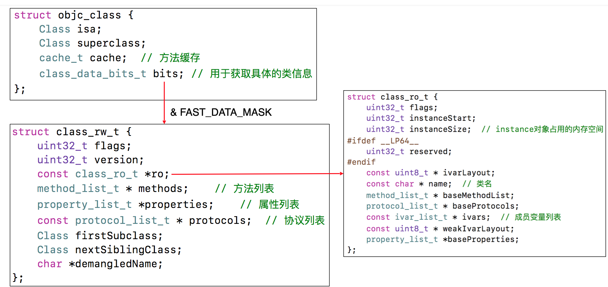

# OC对象

## 对象的本质

<details><summary>一个NSObject对象占多少内存</summary>16字节</details>
<details><summary>将文件编译为iphone平台的cpp文件</summary>xcrun -sdk iphoneos clang -arch arm64 -rewrite-objc 文件名 -o 目标文件名.app</details>
```objectivec
// Implementation
struct NSObject_IMP {
	Class isa;    // 8个字节
}

NSObject *obj = [[NSObject alloc] init];
    
// NSObject实例对象成员变量所占用的大小：8
NSLog(@"%zd", class_getInstanceSize([NSObject class]));
    
// obj 指针所指向内存大小 16
NSLog(@"%zu",malloc_size((__bridge const void*)anim));
```

iOS系统，小端模式读取内存

class_getInstanceSize返回的大小遵循内存对其，为8的倍数

libmalloc分配内存时有内存对齐规则，为16的倍数

sizeof(obj)只是在编译阶段直接把obj指针的大小转成数字，是运算符并不是调用方法

## 对象的分类

实例对象，通过alloc出来的对象

* isa指针

* 其它成员变量

类对象

获取类对象的方法：

```objectivec
NSObject *obj = [[NSObject alloc] init];
Class objClass = [obj class];
Class objClass2 = object_getClass(obj);
Class objClass3 = [NSObject class];
NSLog(@"%p %p %p",objClass,objClass2,objClass3);
```

* isa指针

* superclass指针

* 类的属性信息
* 类的成员变量的描述信息
* 实例方法信息

* 类的协议信息，类的成员变量信息(ivar)

元类对象

获取元类对象的方法：

```objectivec
// 将类对象传入，获得元类对象
Class objectMetaClass = object_getClass([NSObject class]);

// class 方法，返回的始终是类对象。并不能返回元类对象
Class objClass = [[NSObject class] class];
```

每个类在内存中有且仅有一个meta-class对象

meta-class对象和class对象的内存布局结构一样，但是用途不同，在内存中存储的信息主要包括：

* isa指针

* superclass指针

* 类方法信息

## isa 指针

<details><summary>instance的isa</summary>指向class，当调用对象方法时，通过instance的isa找到class，最后找到对象方法的实现进行调用
</details>

<details><summary>class的isa</summary>指向meta-class,当调用类方法时，通过class的isa找到meta-class，最后找到类方法的实现进行调用</details>
> 64系统，对象的isa&ISA_MASK获取的才是对象的类对象地址，类对象的isa&ISA_MASK才是元类的地址

## superclass指针

### class对象

Student的instance对象要调用Person的方法时，会先通过isa找到Student的类对象，然后通过superclass找到Person的类对象，最后找到对象方法的实现进行调用

类对象的superclass指向父类的类对象

### meta-class对象

元类对象的superclass指向父类的元类对象，Root class的superclass指向Root class的类对象

## class结构

### 

