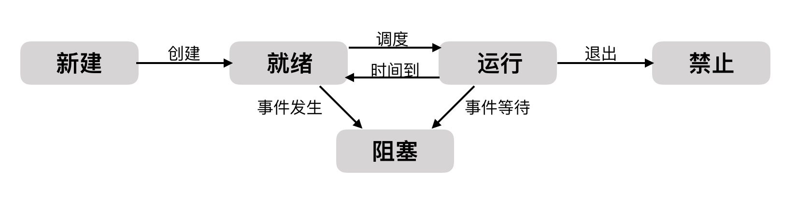

# Process

## 进程与线程

### 进程的概念

多道程序环境下，允许多个程序并发执行，此时他们将失去封闭性，并具有间断性及不可再现性的特征。为此引入了进程的概念，以便更好地描述和控制程序的并发执行，实现操作系统的并发性和共享性。

为了使参与并发执行的程序能够里运行，必须为之配置一个专门俄数据结构，成为进程控制快**(Process Control Block,PCB)**。系统利用PCB来描述进程的基本情况和运行态，进而控制和管理进程，实质上是创建进程映像中的PCB；而撤销进程，实质上是撤销进程的PCB。

注意⚠️ PCB是进程存在的唯一标志！

引入进程实体的概念后，我们可把传统操作系统中的进程定义为：进程是进程实体的运行过程，是系统进行资源分配和调度的一个单独单位。

### 进程的状态与转换

通常进程有以下5种状态，前3种为基本状态：

1. **运行态**。进程正在处理机上运行。在单处理机环境下，每个时刻最多只有一个进程处于运行态。

2. **就绪态**。进程已处于准备运行的状态，即进程获得了除处理机以外的一切所需资源，一旦得到处理机即可运行。

3. **阻塞态**。又称等待态。进程正在等待某一事件而暂停运行，如等待某资源为可用（不包括处理机）或等待输入/输出完成。即使处理机空闲，该进程也不能运行。

4. **创建态**。进程正在被创建，尚未转到就绪态。创建进程通常需要多个步骤：首先申请一个空白的PCB，并向PCB中填写一些控制和管理进程的信息；然后由系统为该进程分配运行时所必须的资源；最后把该进程转入就绪态。

5. **结束态**。进程正从系统中消失，可能是进程正常结束或其他原因中断推出运行。进程需要结束运行时，系统首先必须只该进程为结束态，然后再进一步处理资源释放和回收等工作。

以下是5中状态的转换：



* **就绪态==>运行态**：处于就绪态的进程被调度后，获得处理机资源(分派处理机时间片)，于是进程有就绪态转为运行态。
* **运行态==>就绪态**：处于运行态的进程在时间片用完后，不得不让出处理机，从而进程由运行态转换为就绪态。在刻薄多的操作系统中，当有更高优先级的进程就绪时，调度程序将正执行的进程转换为就绪态，让更高优先级的进程执行。
* **运行态==>阻塞态**：进程请求某一资源（如外设）的使用和分配或等待某一事件的发生（如I/O操作的完成）时，他就从运行态转换为阻塞态。进程以系统调用的形式请求操作系统提供服务，这是一种特殊的、由运行用户态程序调用操作系统内核过程的形式。
* **阻塞态==>就绪态**：进程等待的时间到来，如I/O操作结束或中断结束时，中断处理程序必须把相应进程的状态由阻塞态转换为就绪态。

> 需要注意的是，一个进程由运行态变成阻塞态是主动行为，从阻塞态变成就绪态是被动行为，需要其他相关进程的协助。

### 线程与多线程

引入线程是为了减小程序在并发执行时所付出的时空开销，提高操作系统的并发性能。线程最直接的理解就是“轻量级进程”，它是一个基本的CPU执行单元，也是程序执行流的最小单元，由线程ID、程序计数器、寄存器集合和堆栈组成。

线程自己不拥有系统资源，只用有一点在运行中必不可少的资源，但它可以与同属一个进程的其他线程共享进程所拥有的全部资源。线程也有**就绪、阻塞**和**运行**三种状态。

多线程的模型分为三种：

1. 多对一模型。将多个用户及线程映射到一个内核级线程，线程管理在用户空间完成。此模式中，用户及线程对操作系统不可见。
   * 优点：线程管理在用户空间进行，因而效率比较高。
   * 缺点：一个线程在使用内核服务是被阻塞，整个进程都会被阻塞；多个线程不能并行的运行在多处理机上。
2. 一对一模型。将每个用户及线程映射到一个内核及线程。
   * 优点：当一个线程被阻塞后，允许另一个线程继续执行，所以并发能力较强。
   * 缺点：每创建一个用户及线程都需要创建一个内核及线程与其对应，这样创建线程的开销比较大，会影响到应用程序的性能。
3. 多对多模型。将n个用户级别线程映射到m个内核级线程上，要求m<=n。
   * 特点：对多对模型是多对一模型和一对一模型的折中，及克服了多对一模型并发度不高的缺点，又克服了一对一模型的一个用户进程占用太多内核及线程而开销太大的缺点。此外，还拥有多对一模型和一对一模型各自的优点。

## 进程同步

**临界资源**：我们称一次仅允许一个进程使用的资源成为临界资源。

**同步**：同步亦称直接制约关系，是指未完成某种任务而建立的两个或多个进程，这些进程因为需要在某些位置上协调他们的工作次序而等待、传递信息锁产生的制约关系。进程间的直接制约关系源于他们之间的相互合作。

例如：进程A通过单缓冲向B提供数据。当缓冲区空时，进程B不能获得所需数据而被阻塞，一旦进程A将数据送入缓冲区，进程B就被唤醒。反之，当缓冲区满时，进程A被阻塞，仅当进程B取走缓冲数据时，才唤醒进程A。

**互斥**：互斥亦称间接制约关系。当一个进程进入临界区使用临界资源，另一个进程必须等待，当占用临界资源的进程退出临界区后，另一进程才允许去访问此临界资源。

例如：在仅有一台打印机的系统中，有两个进程A和进程B，若进程A需要打印时，系统已将打印机分配给进程B，则进程A必须阻塞。一旦进程B将打印机释放，系统便将进程A唤醒，并将其有阻塞态变为就绪态。

为禁止两个进程同时进入临界区，同步机制应遵循以下准则：

1. 空闲让进（临界区空闲，允许一个进程进入）
2. 忙则等待（临界区被占，其他进程等待）
3. 有限等待（在有限时间内进入）
4. 让权等待（进程不能进入临界区，应立即释放处理器，防止进程忙等待）

### 实现互斥

#### 软件实现

Peterson's Algorithm:

```c
Pi 进程                                Pj进程
flag[i] = true;turn = j;              flag[j] = true;turn = i;            //进入区
while(flag[j]&&turn==j);              while(flag[i]&&turn==i);            //进入区
critical section;                     critical section;                   //临界区
flag[i] = false;                      flag[j] = false;                    //退出区
remainder section;                    remainder section;                  //剩余区
```

具体如下：考虑进程Pi，一旦设置flag[i]=true，就表示他想要进入临界区，同时turn=j，此时若进程Pj已在临界区中，符合进程Pi中的while循环条件，则Pi不能进入临界区。若Pj不想进入临界区，即flag[j]=false，循环条件不符合，则Pi可以顺利进入，反之依然。

####  信号量

信号量机制时一种功能较强的机制，可用来解决互斥与同步问题，他只能被两个标准的原语wait(S)和signal(S)访问，也可记为“P操作”和“V操作”。

原语是指完成某种功能切不被分割、不被中断执行的操作序列，通常可有硬件来实现。

1. 整形信号量：整形信号量被定义为一个用于表示资源数目的整形量S，wait和signal操作可以描述为：

   ```c
   wait(S) {
     	while (S <= 0);
     	S = S - 1;
   }
   signal(S) {
     	S = S + 1;
   }
   ```

   wait操作中，只要信号量S<=0，就会不断地测试。因此，该机制并为遵循“让权等待”，而是让进程处于“忙等”状态。

2. 记录型信号量：

   除需要一个用于代表资源数目的整形变量value外，再增加一个进程链表L，用于链接所有等待该资源的进程。记录型信号量得名于采用了记录型的数据结构。可描述为：

   ```c
   typedef struct {
     	int value;
     	struct process *L;
   }semaphore;
   
   // wait(S)与signal(S)
   
   void wait(semaphore S) {
     	S.value--;
     	if (S.value < 0) {
         	add this process to S.L;
         	block(S.L);
       }
   }
   void signal(semaphore S) {
     	S.value ++;
     	if (S.value <= 0) {
         	remove a process P frome S.L;
         	wakeup(P);
       }
   }
   ```
   
3. 信号量实现同步：

   设S为实现进程P1、P2同步的公共信号量，初值为0。进程P2中的语句y要使用进程P1中语句x的运行结果，所以只有当语句x执行完成之后语句y才可以执行：

   ```c
   semaphore S = 0;
   P1() {
       x;
     	V(S);
     	...
   }
   P2() {
     	...
       P(S);
     	y;
     	...
   }
   ```

4. 信号量实现互斥：

   ```c
   semaphore S = 1; 		//初始化信号量
   P1() {
     	...
       P(S);						//准备开始访问临界资源，加锁
     	进程P1的临界区
       V(S);						//访问结束，解锁
     	...
   }
   P2() {
     	...
       P(S);						//准备开始访问临界资源，加锁
     	进程P2的临界区
       V(S);						//访问结束，解锁
     	...
   }
   ```

经典的同步问题：生产者-消费者、读者-写着、哲学家进餐、吸烟者问题。

## 死锁

